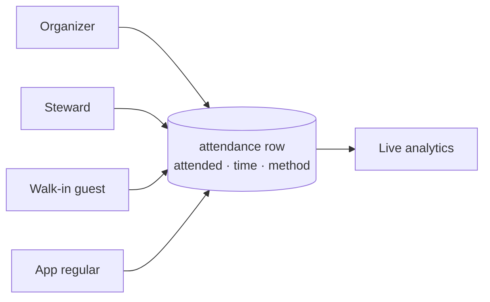
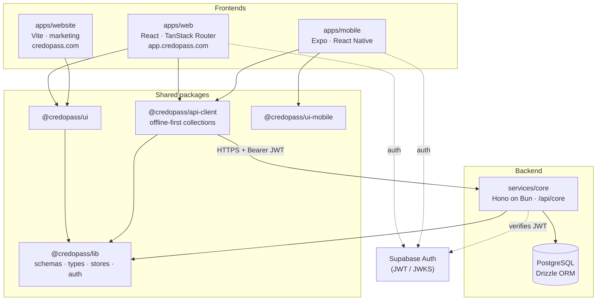
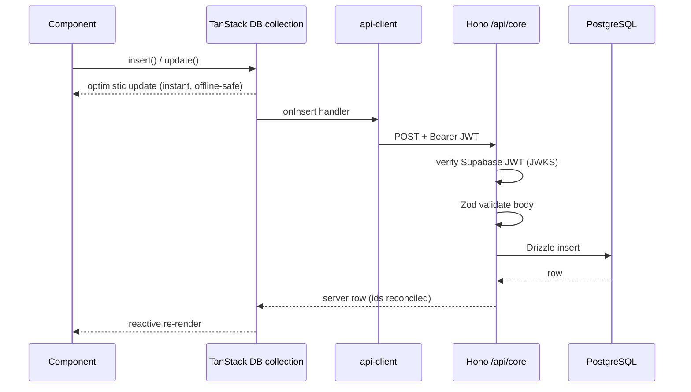
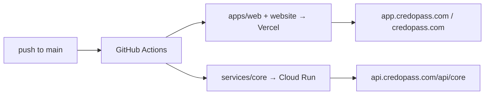

# CredoPass

**Track who _actually_ shows up — not just who signed up.**

CredoPass is an attendance platform for organizations that meet regularly — churches, clubs, meetups, communities. Ticketing tools (EventBrite, Meetup) tell you who *bought in*. CredoPass tells you who *walked in*: a durable, timestamped attendance record for every person at every event, plus the analytics that come from it.

It runs alongside whatever you already use. No tickets required.

---

## Table of contents

1. [The one big idea](#the-one-big-idea)
2. [How it works (the 60-second version)](#how-it-works-the-60-second-version)
3. [System architecture](#system-architecture)
4. [The request lifecycle](#the-request-lifecycle)
5. [Auth & multi-tenancy](#auth--multi-tenancy)
6. [Data model](#data-model)
7. [Tech stack](#tech-stack)
8. [Repository map](#repository-map)
9. [Project status](#project-status) ← _**what's left before MVP**_
10. [Package guides](#package-guides) ← _the deep dive lives in these_
11. [Getting started](#getting-started)
12. [Everyday commands](#everyday-commands)
13. [Deployment](#deployment)
14. [Conventions](#conventions)

---

## The one big idea

Everyone who touches an event — the organizer, the steward, a walk-in guest, a returning regular — ends up writing to **the same place**: one `attendance` row per (event, person). That single source of truth is why the dashboard can be trusted.



> **A note on check-in.** `events.checkInMethods` (`qr` / `manual` / `external_auth`) is just config for *which* check-in mechanisms a door offers — a UI setting. The actual record of attendance is the `attendance` row, uniquely keyed on `(eventId, patronId)`. Attendance is always reconstructable from the database.

## How it works (the 60-second version)

1. An **organizer** creates an org, invites a team, and sets up an event (venue, time, capacity, check-in methods).
2. Every event gets a **shareable link + QR**. The organizer opens the **kiosk** on any phone/tablet.
3. **Attendees** arrive and are recorded — by QR scan, manual entry, or self-service on a public event page that needs no login or app.
4. Each check-in writes **one attendance row**. Regulars also earn **loyalty** points/tiers.
5. **Analytics** update live: who came, when they arrived, trends over time.

The marketing site's [`/how-it-works`](apps/website/src/pages/HowItWorks.tsx) page walks each persona's journey in detail.

## System architecture

CredoPass is an **Nx monorepo** (Bun workspaces): three frontends and one backend, all sharing one schema/type/data core.



Everything points inward at `@credopass/lib` — the schema is defined once, and the DB migrations, the API validation, the client collections, and every TypeScript type are all derived from it.

## The request lifecycle

What happens when the app writes data:



## Auth & multi-tenancy

- **Authentication** is **Supabase**. The client holds the session; every API request carries `Authorization: Bearer <jwt>`. The API verifies it against Supabase's JWKS endpoint — no shared secret (see [`services/core`](services/core/README.md)).
- **The public event surface** (`/api/core/public/*`) is deliberately open — it's how a walk-in guest checks in with no account. It's mounted *before* the auth middleware and can only touch one event id.
- **Multi-tenancy** (**designed, not yet enforced**): the `organizations` table is the intended tenant boundary. Users join orgs through `orgMemberships` with a role (`owner`/`admin`/`member`/`viewer`); events carry a team through `eventMembers` (`organizer`/`co-host`/`staff`/`volunteer`).
  > ⚠️ **Today the boundary is not enforced.** CRUD routes do not filter by the caller — `organizationId` is an optional client-supplied query filter — and RLS policies are dev-permissive. Every signed-in user sees every organisation's data. Read **[docs/MULTI-TENANCY.md](docs/MULTI-TENANCY.md)** before building anything that assumes isolation.

## Data model

Seven tables, all keyed off `organizations`. Full column-level detail and the ER diagram live in the **[lib package guide](packages/lib/README.md#the-data-model-7-tables)**.

`organizations` · `orgMemberships` · `users` · `events` · `eventMembers` · `attendance` · `loyalty`

## Tech stack

| Layer | Choice |
|-------|--------|
| Monorepo | **Nx** + **Bun** workspaces |
| Web | **React 19** (React Compiler), **Vite** (rolldown), **TanStack Router/Query/DB**, **Base UI**, **Tailwind v4** |
| Mobile | **Expo** / **React Native**, React Navigation |
| Marketing | **Vite** + React, dependency-free History router |
| Backend | **Hono** on **Bun**, **Drizzle ORM**, **PostgreSQL 16** |
| Validation | **Zod**, generated from Drizzle via **drizzle-zod** |
| Auth | **Supabase** (JWT verified via JWKS) |
| Hosting | Web/site → **Vercel** · API → **Google Cloud Run** |

## Repository map

```
credopass/
├── apps/
│   ├── web/         → the product: dashboard, kiosk, public event page   (Vercel)
│   ├── mobile/      → Expo / React Native companion
│   └── website/     → marketing site + /how-it-works                     (Vercel)
├── services/
│   └── core/        → Hono API, /api/core                                (Cloud Run)
├── packages/
│   ├── lib/         → schemas, types, enums, stores, theme, auth  ← the core
│   ├── api-client/  → offline-first TanStack DB collections
│   ├── ui/          → web design system (Base UI + Tailwind)
│   └── ui-mobile/   → React Native design system
├── docker/          → Postgres + local orchestration (see docker/README.md)
├── .github/         → CI/CD workflows (see .github/workflows/README.md)
└── nx.json, package.json, tsconfig.base.json
```

## Project status

| Document | Read it to understand… |
|---|---|
| 📋 [**MVP readiness**](docs/MVP-READINESS.md) | A forensic snapshot of what works, what's a shell, and the distance to a usable product. **Start here if you're wondering "what's left?"** |
| 🔐 [**Multi-tenancy plan**](docs/MULTI-TENANCY.md) | Why every user currently shares one workspace, and the ordered refactor to give each their own. The one P0. |

## Package guides

**Start here, then follow your interest.** Each package documents itself in depth:

| Guide | Read it to understand… |
|-------|------------------------|
| 🧠 [`packages/lib`](packages/lib/README.md) | The schema-first core: tables, the data model, how types/validation are generated. **The best first read.** |
| 🔌 [`packages/api-client`](packages/api-client/README.md) | How apps read/write data with offline-first collections. |
| 🎨 [`packages/ui`](packages/ui/README.md) | The web design system + house style + Base UI conventions. |
| 📱 [`packages/ui-mobile`](packages/ui-mobile/README.md) | The React Native design system. |
| 🖥️ [`apps/web`](apps/web/README.md) | Routing, the kiosk, the public event page, screen data flow. |
| 📲 [`apps/mobile`](apps/mobile/README.md) | Navigation and native check-in. |
| 🌐 [`apps/website`](apps/website/README.md) | The marketing site + the horizontal-scroll `/how-it-works` page. |
| ⚙️ [`services/core`](services/core/README.md) | The API: middleware, the CRUD factory, auth, the public surface. |

## Getting started

**Prerequisites:** [Bun](https://bun.sh) ≥ 1.3 and Docker Desktop (running).

```bash
bun install
nx run coreservice:setup
```

`setup` does everything: checks your tools, creates `services/core/.env` from the template, starts Postgres + MinIO + the throwaway test database, applies migrations locally, and generates `openapi.json`. It never touches a remote database and never overwrites an existing `.env`. Re-run it any time.

Then fill in two values in `services/core/.env`:

```env
SUPABASE_URL=https://<your-ref>.supabase.co
SUPABASE_ANON_KEY=<the anon key>
```

And run it:

```bash
bun start        # web + API together
```

| What | Where |
|---|---|
| Web app | http://localhost:5000 (AirPlay often takes 5000 — check the terminal, it's usually 5001) |
| API (new) | http://localhost:8080/api/v1/core |
| API (old) | http://localhost:8080/api/core |
| **API docs + client** | **http://localhost:8080/api/v1/core/docs** |

For the web app to reach a local API, set `VITE_API_URL=http://localhost:8080/api/core` in `apps/web/.env`.

### Exploring the API

The API is the product, so there's a full client built into the docs page:

```bash
nx run coreservice:docs     # opens Scalar — browse endpoints and send real requests
nx run coreservice:token    # mint a JWT, paste it into Scalar's auth box
```

Every endpoint has a "Test Request" panel that hits your local server. Your token persists across reloads.

Prefer a desktop app? Export the spec and import it into [Scalar](https://scalar.com/download), Postman, or Insomnia:

```bash
nx run coreservice:openapi:export     # writes services/core/openapi.json
```

### Standing up the database

Three containers, all managed by nx — you shouldn't need raw `docker` commands.

| Container | Port | What for |
|---|---|---|
| `credopass-postgres` | 5432 | Your dev database (`credopass_db`) |
| `credopass-minio` | 9000 / 9001 | S3-compatible storage for event covers and avatars |
| `credopass-postgres-test` | 55432 | Throwaway database for the test suites — truncated between runs |

```bash
nx run coreservice:dev:up      # postgres + minio (+ creates the media bucket)
nx run coreservice:db:status   # does this database match the code?
nx run coreservice:db:reset    # drop everything and rebuild from migrations
nx run coreservice:seed        # sample data
nx run coreservice:dev:down    # stop everything
nx run coreservice:dev:logs
```

**Start here if anything looks wrong:**

```bash
nx run coreservice:db:status
```

It prints the host, the tables, the RLS policies and — the part that matters — whether the migration journal agrees with the migrations on disk. It exits non-zero and tells you the fix if not.

**The failure worth knowing about.** A database created with `drizzle-kit push` has tables but an *empty migration journal*. It looks fine and is unusable: `drizzle-kit migrate` then tries to `CREATE TABLE` over the top and fails. `db:status` detects exactly this; `db:reset` fixes it.

```bash
nx run coreservice:db:reset
```

`db:reset` drops the `public`, `app` and `drizzle` schemas and replays every committed migration. It **refuses to run against any host that isn't localhost** — it's destructive by design, and a typo in `DATABASE_URL` must not be able to take out a live instance.

A healthy local database has **13 tables, 12 RLS policies, 7 migrations recorded**, and a `credopass_api` role with `bypassrls: false`.

**Which database am I pointed at?** `services/core/.env` → `DATABASE_URL`. Local is the default. The remote Supabase instance has *not* been migrated for the rebuild, so pointing at it makes `/api/v1/core` return 500 on everything. The API says so at boot rather than leaving you to guess.

### Checking your work

```bash
nx run coreservice:verify             # lint + typecheck + unit tests — all must pass
nx run coreservice:test:adversarial   # tenancy suite (starts its own database)
```

The adversarial suite is **expected to fail** right now — it's 47 tests written ahead of the code they guard, and they go green as the [API-first rebuild](docs/API-FIRST-REBUILD.md) lands. Everything else must be green.

### Stopping

```bash
nx run coreservice:dev:down    # stops all containers
```

## Everyday commands

```bash
bun start                     # run web + API together (nx run-many)

nx run web:serve              # web dev server (:5000)
nx run coreservice:start      # API dev server (:8080, bun --watch)
nx run website:serve          # marketing site (:4200)

nx run coreservice:migrate    # generate + apply migrations
nx run coreservice:studio     # Drizzle Studio (browse the DB)
nx run coreservice:seed       # seed data

nx run web:typecheck          # typecheck the web app
nx affected -t lint test      # lint/test only what changed
nx graph                      # visualise the dependency graph
```

## Deployment



- **Frontends → Vercel.** `apps/web/vercel.json` proxies `/api/*` to the API and adds security headers; `apps/website/vercel.json` does the SPA fallback + API proxy.
- **API → Google Cloud Run** via `nx run coreservice:deploy` (Docker build from `services/core/Dockerfile`).
- CI/CD workflows and required secrets are documented in [`.github/workflows/`](.github/workflows/README.md).

## Conventions

- **Schema is the source of truth.** Change a table in `packages/lib/src/schemas/tables/`, run `coreservice:migrate`, and types + validation follow. Never hand-write a type that duplicates a table.
- **Apps don't `fetch`.** Read/write through `@credopass/api-client` collections. The one exception is the token-optional public event page.
- **Forms are pages, not dialogs.** Use a page or `SheetDialog` for anything with a keyboard; reserve `Dialog` for single-value edits.
- **Base UI uses render props**, not `asChild` — spread `render={(props) => …}`.
- **Two design systems on purpose**: `@credopass/ui` (web) and `@credopass/ui-mobile` (native) share intent, not code.

---

<sub>Built for organizations that value attendance insight. · People & event illustrations by [Storyset](https://storyset.com).</sub>


### UI REWIRING
 We are finally here we made it. You have done a great job rewiring the whole API. 
 Now majority of the UI exists, however with the multi-tenancy features and new 
 features addedd, we now have a lot to be integrated into the UI and workflow

 ## TASK

 Analyse all the changes, rewrites and changes you have done so far:
 - create a forensic breakdown of all the missing UI-screens, workflows and missing pages
 - We need a new on-boarding set of UIs for new users
 - We need a detailed 'Account' page which allows user to do all the new cool things that have been added. The Account management etc
 - Ensure every endpoint is being used through the UI, in other words if an end-point exists, there has to be a feature that uses it
 - Strip out any unecessary dead code that is no longer valid due to this rewrite
 !!IMPORTANT The REBUILD-LOG can give some more insight

 ### DELIVERY
 API-SECOND_REBUILD
 Your delivery should be a detailed plan that
 1 - shows all that you accomplished in API-FIRST-REBUILD and whats next
 2 - A DETAILED UI PLAN that addresses all the things I stated in the task

 I am to basically dump your new delivery into another agent and it should give him all 
 the necessary context to first know all the API changes that have occured and inmplement the UI-REWIRING
 to connect to these new API and feature and workflows that have become possible

 A secondary part of the plan which should inform the agent of potential next