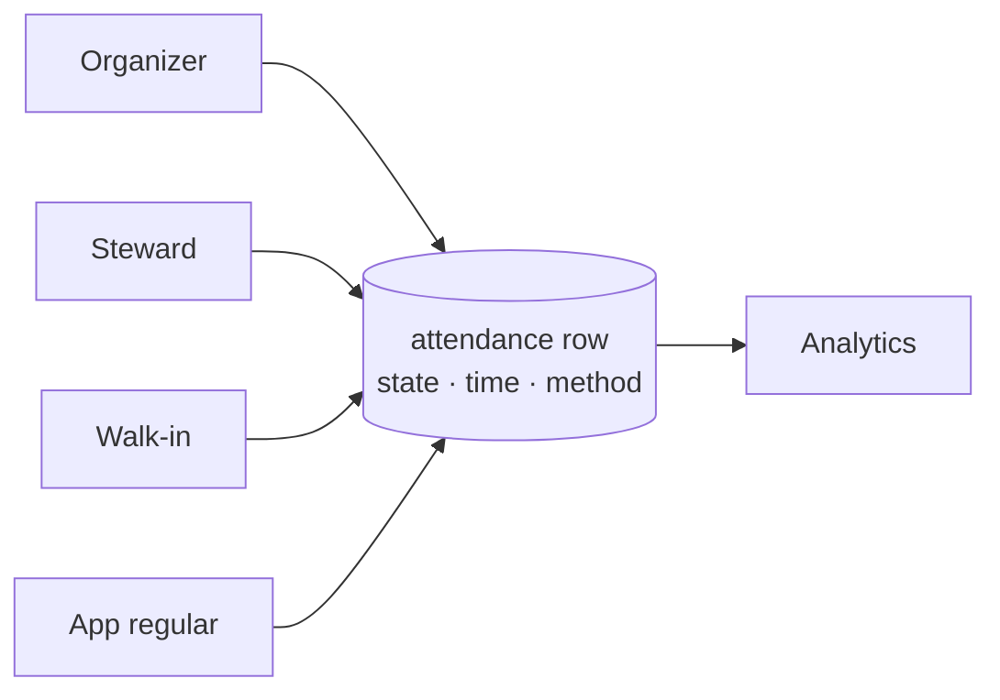
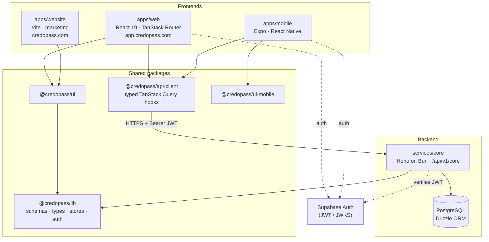
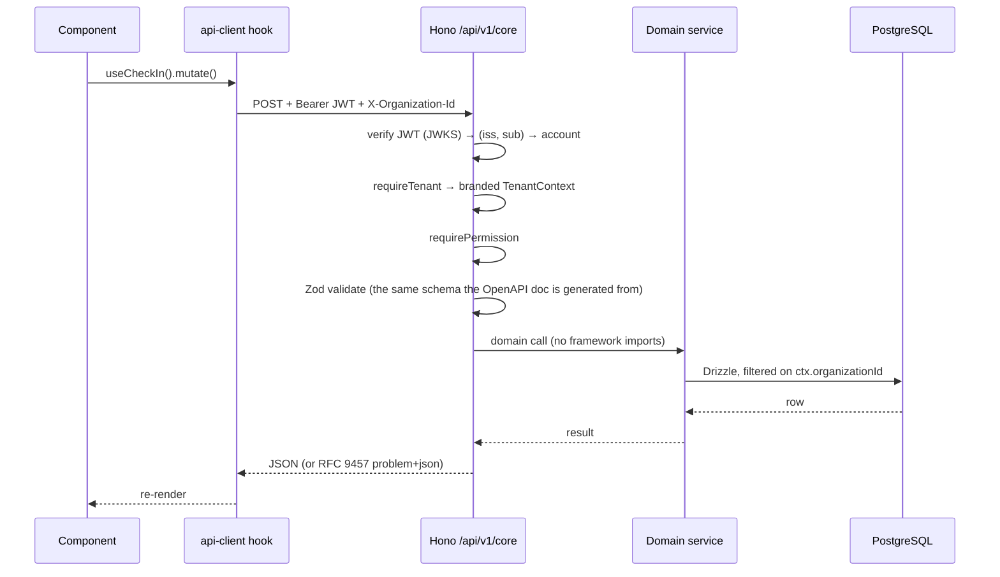
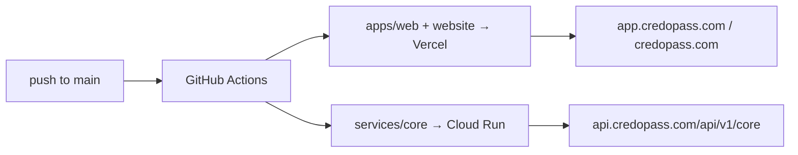

# CredoPass

**Track who _actually_ shows up — not just who signed up.**

CredoPass is an attendance platform for organizations that meet regularly — churches, clubs, meetups, communities. Ticketing tools (EventBrite, Meetup) tell you who *bought in*. CredoPass tells you who *walked in*: a durable, timestamped attendance record for every person at every event, plus the analytics that come from it.

It runs alongside whatever you already use. No tickets required.

---

## Table of contents

1. [The one big idea](#the-one-big-idea)
2. [How it works (the 60-second version)](#how-it-works-the-60-second-version)
3. [System architecture](#system-architecture)
4. [The request lifecycle](#the-request-lifecycle)
5. [Auth & multi-tenancy](#auth--multi-tenancy)
6. [Data model](#data-model)
7. [Tech stack](#tech-stack)
8. [Repository map](#repository-map)
9. [Project status](#project-status) ← _**what's left**_
10. [Package guides](#package-guides) ← _the deep dive lives in these_
11. [Getting started](#getting-started)
12. [Everyday commands](#everyday-commands)
13. [Deployment](#deployment)
14. [Conventions](#conventions)

---

## The one big idea

Everyone who touches an event — the organizer, the steward, a walk-in, a returning regular — ends up writing to **the same place**: one `attendance` row per (event, person). That single source of truth is why the dashboard can be trusted.



> **A note on check-in.** `events.checkInMethods` (`qr` / `manual` / `self` / `pass`) is just config for *which* mechanisms a door offers — a UI setting. The record is the `attendance` row, unique on `(event_id, person_id)`, whose `state` distinguishes `registered` from `attended` from `no_show`. That distinction is the product.

## How it works (the 60-second version)

1. An **organizer** signs in — which commissions an organization; there is no separate onboarding — invites a team, and sets up an event (venue, time, capacity, check-in methods).
2. Every event gets a **shareable link + QR**. The organizer opens the **kiosk** on any phone or tablet.
3. **Attendees** arrive and are recorded — by QR scan, manual entry, or self-service on a public event page that needs no login and no app.
4. Each check-in writes **one attendance row**, and each registration issues a **pass** whose token in the URL is the credential.
5. **Analytics** read from those rows: who came, when they arrived, who registered and never turned up.

The marketing site's [`/how-it-works`](apps/website/src/pages/HowItWorks.tsx) page walks each persona's journey in detail.

## System architecture

CredoPass is an **Nx monorepo** (Bun workspaces): three frontends and one backend, all sharing one schema/type/data core.



The schema is defined once in `@credopass/lib` — the migrations, the API's request validation, the OpenAPI document and every client type are all derived from it.

**One API surface: `/api/v1/core`.** The old `/api/core` CRUD layer and its factory were deleted; the service 404s that path. If you find `/api/core` in a config, that config is a bug.

## The request lifecycle



## Auth & multi-tenancy

- **Authentication is Supabase.** The client holds the session; every API request carries `Authorization: Bearer <jwt>`. The API verifies it against the issuer's JWKS — no shared secret.
- **Four route scopes**, declared per route and checked at boot: `organization` (JWT + `X-Organization-Id` + a permission), `account` (JWT, self-scoped), `public` (none), `bearer` (a pass token in the URL).
- **The tenant comes from the token, never from the request.** A client may say *which* of its organizations it wants; it may never say which it belongs to.
- **A resource in another tenant returns 404, not 403.** 403 means "your tenant, wrong role". Never leak that a row exists.
- **There is no guest tier and no device tier.** A door tablet is a person signed in with the `checkin` role.

> ⚠️ **RLS is currently inert on the API path.** The membership-scoped policies in `services/core/drizzle/0001_rls.sql` exist and are correct, but the API connects as `postgres`, which is `BYPASSRLS` — so today tenancy rests on exactly one layer: the explicit `ctx.organizationId` predicate every domain service applies, which the 47-test adversarial suite polices. Switching to the `credopass_api` role requires wiring `SET LOCAL app.account_id` per transaction first. The ordered fix is [`docs/DATABASE-MIGRATION.md` §6](docs/DATABASE-MIGRATION.md).

## Data model

Eleven tables, all hanging off `organizations`. The rewrite split the old `users` table three ways — **`accounts`** (the login), **`identities`** (the credential proving it), **`people`** (the record an *organisation* keeps about someone). Full column-level detail and the ER diagram are in the **[lib package guide](packages/lib/README.md#the-data-model-11-tables)**.

`accounts` · `identities` · `organizations` · `org_memberships` · `people` · `events` · `attendance` · `passes` · `invitations` · `org_domains` · `org_identity_providers`

## Tech stack

| Layer | Choice |
|-------|--------|
| Monorepo | **Nx** + **Bun** workspaces |
| Web | **React 19** (React Compiler), **Vite** (rolldown), **TanStack Router/Query/Form**, **Base UI**, **Tailwind v4** |
| Mobile | **Expo** / **React Native**, React Navigation |
| Marketing | **Vite** + React, dependency-free History router |
| Backend | **Hono** on **Bun**, **Drizzle ORM**, **PostgreSQL 16** |
| API contract | **Zod** → **@hono/zod-openapi** → `openapi.json` → **openapi-typescript** |
| Auth | **Supabase** (JWT verified via JWKS) |
| Hosting | Web/site → **Vercel** · API → **Google Cloud Run** |

## Repository map

```
credopass/
├── apps/
│   ├── web/         → the product: console, kiosk, public event page   (Vercel)
│   ├── mobile/      → Expo / React Native companion
│   └── website/     → marketing site + /how-it-works                   (Vercel)
├── services/
│   └── core/        → Hono API, /api/v1/core                           (Cloud Run)
├── packages/
│   ├── lib/         → schemas, types, enums, stores, theme, auth  ← the core
│   ├── api-client/  → typed TanStack Query hooks (the ONLY way apps get data)
│   ├── ui/          → web design system (Base UI + Tailwind v4)
│   └── ui-mobile/   → React Native design system
├── docs/            → the rebuild plan, the log, the migration guide
├── docker/          → Postgres + MinIO + the test database
├── .github/         → CI/CD workflows
└── nx.json, package.json, tsconfig.base.json
```

## Project status

The repo has been rebuilt API-first. What that meant, and what is left:

| Document | Read it to understand… |
|---|---|
| 📐 [**API-FIRST-REBUILD**](docs/API-FIRST-REBUILD.md) | The plan — decisions, target schema, the full endpoint list, the phases. |
| 📓 [**REBUILD-LOG**](docs/REBUILD-LOG.md) | What was **actually** built, decided differently, or broke. Updated at the end of every phase. |
| 🖥️ [**API-SECOND-REBUILD**](docs/API-SECOND-REBUILD.md) | Moving the web app onto `/api/v1/core`. |
| 🚪 [**API-THIRD-REBUILD**](docs/API-THIRD-REBUILD.md) | The sign-up funnel (D20–D26): no guest tier, no device tokens, no onboarding screen. |
| 🗄️ [**DATABASE-MIGRATION**](docs/DATABASE-MIGRATION.md) | How to get the schema onto a database — local, test, and the remote Supabase cutover. |
| 📋 [**NEXT-UI-LIST**](docs/NEXT-UI-LIST.md) | The open UI backlog. |

**The two largest open items** are both in `DATABASE-MIGRATION.md`: the `users` → `accounts` + `people` data migration has not been written, and RLS is not yet live on the API path.

## Package guides

**Start here, then follow your interest.** Each package documents itself in depth:

| Guide | Read it to understand… |
|-------|------------------------|
| 🧠 [`packages/lib`](packages/lib/README.md) | The schema-first core: the 11 tables, and how types and validation are derived. **The best first read.** |
| 🔌 [`packages/api-client`](packages/api-client/README.md) | How apps read and write — typed hooks over a generated contract. |
| 🎨 [`packages/ui`](packages/ui/README.md) | The web design system, the house style, Base UI conventions. |
| 📱 [`packages/ui-mobile`](packages/ui-mobile/README.md) | The React Native design system. |
| 🖥️ [`apps/web`](apps/web/README.md) | Routing, the kiosk, the public surface, how a screen gets its data. |
| 📲 [`apps/mobile`](apps/mobile/README.md) | Navigation and native check-in. |
| 🌐 [`apps/website`](apps/website/README.md) | The marketing site and the horizontal-scroll `/how-it-works` page. |
| ⚙️ [`services/core`](services/core/README.md) | The API: the seven rules, middleware, auth, the public surface. |

## Getting started

**Prerequisites:** [Bun](https://bun.sh) ≥ 1.3 and Docker Desktop (running).

```bash
bun install
nx run coreservice:setup
```

`setup` does everything: checks your tools, creates `services/core/.env` from the template, starts Postgres + MinIO + the throwaway test database, applies migrations **to localhost only**, and generates `openapi.json`. It never touches a remote database and never overwrites an existing `.env`. Re-run it any time.

Then fill in two values in `services/core/.env`:

```env
SUPABASE_URL=https://<your-ref>.supabase.co
SUPABASE_ANON_KEY=<the anon key>
```

And run it:

```bash
bun start        # web + API together
# kill with: pkill -f "nx run web:serve|nx run coreservice:start"
```

| What | Where |
|---|---|
| Web app | http://localhost:5000 (AirPlay often takes 5000 — check the terminal, it's usually 5001) |
| API | http://localhost:8080/api/v1/core |
| **API docs + client** | **http://localhost:8080/api/v1/core/docs** |
| MinIO console | http://localhost:9001 |

For the web app to reach a local API, set `VITE_API_URL=http://localhost:8080/api/v1/core` in `apps/web/.env`.

### Exploring the API

The API is the product, so there's a full client built into the docs page:

```bash
nx run coreservice:docs     # opens Scalar — browse endpoints and send real requests
nx run coreservice:token    # mint a JWT, paste it into Scalar's auth box
```

Prefer a desktop app? Export the spec and import it into [Scalar](https://scalar.com/download), Postman, or Insomnia:

```bash
nx run coreservice:openapi:export     # writes services/core/openapi.json
```

### The database

Three containers, all managed by nx — you shouldn't need raw `docker` commands.

| Container | Port | What for |
|---|---|---|
| `credopass-postgres` | 5432 | Your dev database (`credopass_db`) |
| `credopass-minio` | 9000 / 9001 | S3-compatible storage for event covers and avatars |
| `credopass-postgres-test` | 55432 | Throwaway database for the test suites — truncated between runs |

**Start here if anything looks wrong.** It is read-only, and it names the state you are in:

```bash
nx run coreservice:db status
```

A healthy local database has **11 tables, 11 RLS policies, 4 migrations recorded**, and a `credopass_api` role with `bypassrls: false`.

```bash
nx run coreservice:dev:up      # postgres + minio (+ creates the media bucket)
nx run coreservice:migrate     # apply pending migrations
nx run coreservice:db reset    # drop everything and rebuild from migrations
nx run coreservice:db seed     # sample data
nx run coreservice:dev:down    # stop everything
```

> `db` takes its subcommand as an **argument**: `nx run coreservice:db reset`, not `nx run coreservice:db:reset`.

**The failure worth knowing about.** A database created with `drizzle-kit push` has tables but an *empty migration journal*. It looks fine and is unusable: `drizzle-kit migrate` then tries to `CREATE TABLE` over the top and fails. `db status` detects exactly this; `db reset` fixes it.

`db reset` and `db seed` **refuse to run against any host that isn't localhost.** That is a hostname allow-list, not a `--force` flag, because a flag is something you can pass by accident and a hostname is a fact about where you are aimed.

**Which database am I pointed at?** `services/core/.env` → `DATABASE_URL`. Local is the default. The remote Supabase instance has *not* been migrated for the rebuild, so pointing at it makes `/api/v1/core` return 500 on everything — and the API says so at boot rather than leaving you to guess. Read [`docs/DATABASE-MIGRATION.md`](docs/DATABASE-MIGRATION.md) before changing it.

### Checking your work

```bash
nx run coreservice:verify             # lint + typecheck + unit tests — all must pass
nx run coreservice:test:integration   # services against real Postgres (starts its own DB)
nx run coreservice:test:adversarial   # the 47-test tenancy suite
```

## Everyday commands

```bash
bun start                     # run web + API together (nx run-many)

nx run web:serve              # web dev server (:5000)
nx run coreservice:start      # API dev server (:8080, bun --watch)
nx run website:serve          # marketing site (:4200)

nx run coreservice:db status  # does the DB match the code?
nx run coreservice:migrate    # apply pending migrations
nx run coreservice:studio     # Drizzle Studio (browse the DB)

nx run api-client:generate    # export openapi.json → regenerate the client's types
nx run web:build              # the reliable way to typecheck the web app
nx affected -t lint test      # lint/test only what changed
nx graph                      # visualise the dependency graph
```

## Deployment



- **Frontends → Vercel.** `apps/web/vercel.json` proxies `/api/*` to the API and adds security headers; `apps/website/vercel.json` does the SPA fallback + API proxy.
- **API → Google Cloud Run** via `nx run coreservice:deploy` (Docker build from `services/core/Dockerfile`).
- CI/CD workflows and required secrets are documented in [`.github/workflows/`](.github/workflows/README.md).
- **Every database the code runs against must be migrated before the code ships.** Adding a column is not additive at runtime.

## Conventions

- **Schema is the source of truth.** Change a table in `packages/lib/src/schemas/tables/`, generate the migration, and types + validation follow. Never hand-write a type that duplicates a table.
- **Apps don't `fetch`.** Read and write through a `@credopass/api-client` hook. TanStack **DB** collections are gone and are not coming back.
- **Every route is created with `defineRoute`**, declaring its scope and permission. A bad declaration crashes the service at boot.
- **Errors are `ProblemError`** (RFC 9457). Never `c.json({ error })`, never `HTTPException`.
- **Domain services import no framework.** Nothing under `services/core/src/services/` may import `hono` — lint blocks it.
- **Forms are pages, not dialogs.** Use a page or `SheetDialog` for anything with a keyboard; reserve `Dialog` for single-value edits.
- **Base UI uses render props**, not `asChild` — spread `render={(props) => …}`.
- **Two design systems on purpose**: `@credopass/ui` (web) and `@credopass/ui-mobile` (native) share intent, not code.

---

<sub>Built for organizations that value attendance insight. · People & event illustrations by [Storyset](https://storyset.com).</sub>
