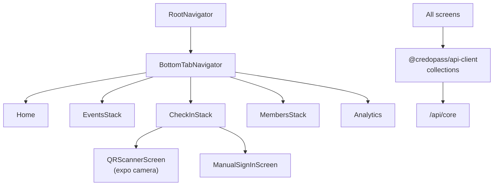

# `mobile` — CredoPass Mobile App

> The on-the-go companion. An [Expo](https://expo.dev) / React Native app for running check-in from a phone and managing events in the field.

**Nx project:** `mobile` · **Depends on:** `@credopass/api-client`, `@credopass/lib`, `@credopass/ui-mobile`, `expo`, `react-native`.

---

## Architecture

Same data brain as the web app (`@credopass/api-client` collections, `@credopass/lib` schemas) with a native shell.



## Structure

| Path | What |
|------|------|
| `src/app.tsx` / `src/app/App.tsx` | Entry point. Calls `configureAPIClient()` with the API URL from `expoConfig.extra.apiUrl`. |
| `src/navigation/` | React Navigation stacks: `RootNavigator`, `BottomTabNavigator`, `EventsStack`, `CheckInStack`, `MembersStack`. |
| `src/screens/` | Screens grouped by feature: `Home`, `Events`, `CheckIn`, `Members`, `Organizations`, `Analytics`, `Tables`. |
| `src/components/` | App-level components (`layout/`, `org-selector/`). |
| `src/hooks/` | Native hooks: `use-biometrics`, `use-camera`. |

## Building blocks

- **UI** from `@credopass/ui-mobile` (native components + theme tokens).
- **Data** from `@credopass/api-client` — the exact same offline-first collections the web app uses.
- **Camera / QR** via Expo + `use-camera`; biometric unlock via `use-biometrics`.

## Running

```bash
# From the repo root (Expo / Metro)
nx run mobile:start      # or: cd apps/mobile && bunx expo start
```

Set the API URL in Expo config (`extra.apiUrl`); it defaults to `http://localhost:3000/api/core`.

> Some navigation/provider wiring is still marked `TODO` in `src/app.tsx` — this app trails the web app in maturity.
