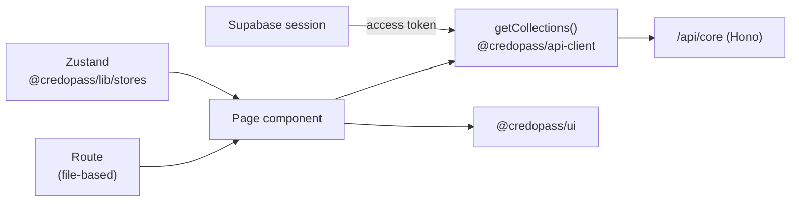

# `web` — CredoPass Web App

> The primary product. The organizer's dashboard, the check-in kiosk, and the public event page. React 19 + TanStack Router, served on Vercel at **app.credopass.com**.

**Nx project:** `web` (`@credopass/web`) · **Dev port:** `5000`.
**Depends on:** `@credopass/ui`, `@credopass/lib`, `@credopass/api-client`, the TanStack stack, `@base-ui/react`, `html5-qrcode`, `qrcode.react`.

---

## How a screen gets its data



- **Routing** — TanStack Router, **file-based**. Routes live in `src/routes/`; `routeTree.gen.ts` is generated by the Vite plugin (don't edit it by hand). Auth-gated routes use `src/lib/auth-guard.ts`.
- **Data** — never `fetch` directly; use `getCollections()` from `@credopass/api-client`. The API client is wired to the Supabase token in `src/main.tsx`.
- **UI state** — Zustand stores from `@credopass/lib/stores` (sidebar, toolbar).
- **Auth** — Supabase (`src/supabase.ts` → `getAccessToken`). Signed-in users get a JWT that every API call carries.

## Routes

| Route | Screen |
|-------|--------|
| `/` | Home / dashboard |
| `/login` | Supabase sign-in |
| `/organizations` | Org list + switcher (multi-tenant) |
| `/events`, `/events/new`, `/events/$eventId`, `/events/$eventId/edit` | Event management + composer |
| `/attendees`, `/attendees/new`, `/attendees/$userId/edit` | Member/patron management |
| `/checkin/$eventId` | **The kiosk** — QR scanner (`html5-qrcode`) + manual sign-in |
| `/e/$eventId` | **Public event page** — token-optional; walk-in register/check-in |
| `/analytics` | Attendance analytics dashboard |
| `/profile`, `/upgrade` | Account + plan upgrade |

## Structure

| Path | What |
|------|------|
| `src/routes/` | File-based route definitions (+ generated `routeTree.gen.ts`). |
| `src/Pages/` | Screen implementations (`Events/`, `Attendees/`, `CheckIn/`, `Analytics/`, `Organizations/`, …). |
| `src/containers/` | App shell + cross-page features: `LeftSidebar`, `TopNavBar`, `RightSidebar`, `Command` (⌘K), `SignInModal`, `AuthScreen`, `OrganizationForm`, `OrgSelector`, `ActionCards`. |
| `src/contexts/premium.tsx` | Plan/entitlement context (gates paid features). |
| `src/hooks/`, `src/lib/`, `src/config.ts` | Hooks, auth guard, config. |

## Key flows to know

- **Kiosk check-in** (`Pages/CheckIn/`) — `use-attendee-checkin.ts` finds-or-creates a user by email, then writes exactly one `attendance` row per (event, patron).
- **Public event page** (`routes/e/$eventId.tsx` + `use-public-event.ts`) — reads from and posts to `/api/core/public/*`, so it works with no login.
- **Event composer** (`Pages/Events/EventComposer/`) — the create/edit form, including the per-event `checkInMethods` toggle.

## Commands

```bash
nx run web:serve       # dev → http://localhost:5000
nx run web:build       # production build
nx run web:preview     # preview the build
nx run web:typecheck
nx run web:lint
```

## API wiring

`main.tsx` calls `configureAPIClient({ baseURL: import.meta.env.VITE_API_URL ?? '/api/core', getAuthToken })`. In dev, point `VITE_API_URL` at the local core service (`http://localhost:8080/api/core`); in production Vercel rewrites `/api/*` to `https://api.credopass.com`.
