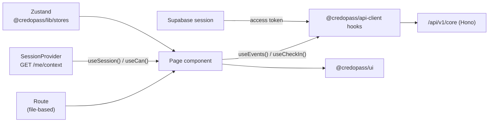

# `web` — CredoPass Web App

> The primary product. The organizer's console, the check-in kiosk, and the public attendee surface.
> React 19 + TanStack Router, served on Vercel at **app.credopass.com**.

**Nx project:** `web` (`@credopass/web`) · **Dev port:** `5000` (AirPlay usually takes it — check the
terminal, it normally lands on `5001`).
**Depends on:** `@credopass/ui`, `@credopass/lib`, `@credopass/api-client`, TanStack
Router/Query/Form, `@base-ui/react`, `html5-qrcode`, `qrcode.react`.

---

## How a screen gets its data



- **Routing** — TanStack Router, file-based. Routes live in `src/routes/`; `routeTree.gen.ts` is
  generated by the Vite plugin — don't edit it. Auth-gated routes use `src/lib/auth-guard.ts`.
- **Data** — never `fetch` directly. Import a hook from `@credopass/api-client`. The client is wired
  to the Supabase token once, in `src/main.tsx`.
- **Session & permissions** — `src/contexts/session.tsx` calls `GET /me/context` at bootstrap and
  exposes `useSession()` and `useCan(permission)`. **Hide what the answer is no to** — never render
  a control that will come back 403.
- **UI state** — Zustand stores from `@credopass/lib/stores` (sidebar, toolbar, launcher).

## Routes

| Route | Screen |
|-------|--------|
| `/` | Home |
| `/login`, `/reset-password` | Supabase sign-in and recovery |
| `/account` | **Everything about you and your org** — `?tab=profile\|organizations\|members\|settings` |
| `/events`, `/events/new`, `/events/$eventId`, `/events/$eventId/edit` | Event management + composer |
| `/attendees`, `/attendees/new`, `/attendees/$userId/edit` | The per-tenant people list |
| `/checkin/$eventId` | **The kiosk** — QR scanner (`html5-qrcode`) + manual sign-in |
| `/analytics` | Analytics (deliberately an empty state — see below) |
| `/upgrade`, `/upgrade/checkout` | The plan picker and a **mock** checkout |
| `/invitations/$token` | Accept an invitation |
| `/e/$eventId` | **Public event page** — no login; register or walk-up check-in |
| `/p/$token` | **The pass** — the token in the URL is the credential |
| `/profile`, `/organizations` | Redirects into the matching `/account` tab. Kept so old links work. |

## Structure

| Path | What |
|------|------|
| `src/routes/` | File-based route definitions (+ generated `routeTree.gen.ts`). |
| `src/Pages/` | Screen implementations (`Events/`, `Attendees/`, `CheckIn/`, `Analytics/`, `Account/`, `Upgrade/`, `Pass/`, `Login/`, `AcceptInvitation/`). |
| `src/containers/` | App shell + cross-page features: `LeftSidebar`, `TopNavBar`, `RightSidebar`, `UserMenu`, `OrgSelector`, `Command` (⌘K), `SignInModal`, `AuthScreen`, `ActionCards`. |
| `src/contexts/session.tsx` | `SessionProvider`, `useSession`, `useCan`. The app's bootstrap. |
| `src/lib/` | `auth-guard.ts`, `errors.ts`, `query-client.ts`. |
| `src/hooks/`, `src/config.ts`, `src/supabase.ts` | Command palette hook, Mapbox token, Supabase client. |

**Two menus, two jobs.** `OrgSelector` (sidebar header) is about the **organization** you are looking
at. `UserMenu` (the avatar, top right) is about the **account** you are signed in as — profile, plan,
theme, sign out. Account items used to live inside the org switcher, which put "where is my profile?"
behind a control branded with the org's logo.

## Things to know before you change anything here

- **There is no guest tier and no onboarding screen.** Signing in commissions an organization
  (`ensureDefaultOrganization`, server-side). That *is* onboarding.
- **There are no device tokens.** A door tablet is a person signed in with the `checkin` role. Do not
  reintroduce a second authentication system for it.
- **`/events/new` renders without a session**, with sign-in overlaid. That overlay is presentation;
  `POST /events` is org-scoped and 401s — *that* is the control.
- **`/analytics` renders an empty state on purpose.** The numbers behind the analytics contract are
  deterministic placeholders (`services/core/src/services/analytics/`), not database reads. Drawing
  charts from them would be inventing data.
- **No email exists yet.** Invitation links and pass URLs come back in the response and must be shown
  on screen. Never write "check your email".

## Key flows

- **Kiosk check-in** (`Pages/CheckIn/`) — resolves a person, then writes exactly one `attendance` row
  per (event, person).
- **Public event page** (`routes/e/$eventId.tsx`) — the token-optional `/public/*` endpoints, so it
  works with no login.
- **Event composer** (`Pages/Events/EventComposer/`) — create/edit, including the per-event
  `checkInMethods` toggle and the signed-out overlay.
- **Checkout** (`Pages/Upgrade/Checkout.tsx`) — an openly-labelled mock. It pre-fills a reserved test
  card and calls `PUT /organizations/{id}/plan`, which writes a column. **No money moves.**

## Commands

```bash
nx run web:serve       # dev → http://localhost:5000 (often :5001)
nx run web:build       # production build — the reliable way to typecheck this app
nx run web:preview     # preview the build
nx run web:lint
```

## API wiring

`main.tsx` calls `configureAPIClient({ baseURL: import.meta.env.VITE_API_URL ?? '/api/v1/core', getAuthToken })`.

In dev, point `VITE_API_URL` at the local core service (`http://localhost:8080/api/v1/core`) in
`apps/web/.env`. In production Vercel rewrites `/api/*` to `https://api.credopass.com`.
