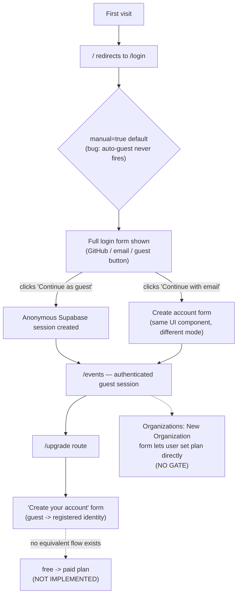

# Part 5 — User Management & Upgrade Path

## Headline finding: there is no gate between "anonymous visitor" and "Enterprise-plan organization owner"

This is the load-bearing fact for this entire part, established by reading actual code, not inferred: **`apps/web/src/containers/OrganizationForm/index.tsx` lets any user pick `plan: free | starter | pro | enterprise` from a dropdown when creating or editing an organization** (lines 73, 97-103), and submits it directly via `organizationCollection.insert()`/`.update()` — a plain write to the `organizations.plan` column. There is no payment step, no Stripe interaction anywhere in the codebase (`grep -rl stripe` across every `package.json`: zero matches, despite `organizations.stripeCustomerId`/`stripeSubscriptionId` columns existing in the schema), and — per `01-architecture.md` §1.5 — **no backend authorization check of any kind** on the `organizations` write route that would stop this. Combined with `services/core/src/routes/org-memberships.ts:68-99`, a `PUT /:id/role` endpoint whose own comment says "(admin only)" but whose handler validates only that the submitted string is one of the four valid role names — never who's asking or what role *they* currently hold — the practical state today is: **any HTTP client can set any organization to Enterprise plan and grant itself/anyone `owner` role on any membership, for free, with no login required.** Every recommendation below is written against this reality.

## 1. Current-state lifecycle audit

### How a new visitor is identified today

- The intended design (per code comments) is guest-first: `apps/web/src/hooks/index.tsx:82-90` documents that a visitor landing on `/login` without `?manual=true` should be silently signed in via `supabase.auth.signInAnonymously()` and redirected to `/events`.
- **This is currently broken.** `02-ui-forensic.md` verified live: `apps/web/src/routes/login.tsx:9` defaults the `manual` search param to `true`, and the root route's redirect to `/login` (`apps/web/src/routes/index.tsx`) never sets `manual` — so `useGuestAutoLogin`'s effect (which only runs when `manual` is `false`) never fires by default. **Every real visitor today sees the full login form**, not a silent guest session. A second, independent bug was also found: even when `manual=false` is forced, the post-sign-in `navigate({ to: '/events' })` call doesn't fire within the same load, consistent with React 18 `<StrictMode>` double-invoking the effect and its `cancelled` closure suppressing the navigation on the real (first) invocation — though the anonymous session itself *does* get created and persisted (confirmed: navigating to `/events` directly afterward loads the authenticated app correctly).
- **What's at risk of being lost if a guest abandons:** currently, nothing beyond the session itself — no draft event, no in-progress form data is persisted anywhere client-side outside of Supabase's own auth-session storage (`03-tanstack-db-migration.md` §3 confirmed no custom pre-persistence cache layer exists). So today's actual risk is narrower than "lost work" — it's "never got in at all," because the intended entry path is inert.

### Guest → registered conversion

- The `/upgrade` route (`apps/web/src/routes/upgrade.tsx`, standalone layout per `apps/web/src/routes/__root.tsx:15`) is where this should happen. Per `02-ui-forensic.md`'s live capture, it renders **"Create your account — Free forever. No credit card required."** with `Email`/`Password` fields and a "Continue as guest instead" fallback — this is a guest→registered-account conversion form, full stop. It has no plan comparison, no pricing, no payment fields.
- **The route name "upgrade" conflates two different lifecycle events that this codebase's own schema treats as separate:** (a) anonymous session → permanent account (an *identity* upgrade, what this screen actually does), and (b) `organizations.plan = free` → `starter`/`pro`/`enterprise` (a *billing* upgrade, what the name implies and what a user would reasonably expect to find here). Nothing in the app currently does (b) as a gated flow at all — the only place `plan` gets set is the ungated dropdown in `OrganizationForm` described above.
- **What happens to the `users` table on conversion is unverified.** No code path was found in this session that inserts/links a `users` row at anonymous-sign-in time, and the `users` table (`00-discovery.md` §5) has no column referencing `auth.users` (no `authUserId`/`supabaseUserId` field). This is a real open question this audit could not resolve from static analysis: **does converting a guest to a registered account create a new, disconnected `users` row, or is there no `users` row at all until this point?** This needs to be answered by tracing the actual `/upgrade` submit handler against the `users` API — flagged rather than guessed at.

### Role/permission model: real as data, enforced nowhere

`org_memberships.role` (`owner | admin | member | viewer`, `00-discovery.md` §5) is well-designed as a schema — documented intent per role in the table's own comment (`packages/lib/src/schemas/tables/org-memberships.ts:14-19`), invitation tracking fields (`invitedBy`/`invitedAt`/`acceptedAt`), a uniqueness constraint. **None of it is checked anywhere in `services/core`.** The clearest single piece of evidence: the role-change endpoint itself, shown in full below, because it's the smoking gun for this entire section.

```ts
// services/core/src/routes/org-memberships.ts:68-99
// PUT /:id/role - Change member role (admin only)
orgMembershipsRouter.put('/:id/role', async (c) => {
  const membershipId = c.req.param('id');
  const { role } = await c.req.json();
  const validRoles = ['owner', 'admin', 'member', 'viewer'];
  if (!validRoles.includes(role)) return c.json({ error: 'Invalid role' }, 400);
  // ...directly updates the row. No check of who is making this request,
  // or what role they currently hold in this organization.
```

The comment says "admin only." The code enforces only that the *value* is a valid enum member — never the *caller's* permission to set it. This is not a subtle gap; it's the complete absence of the check the comment claims exists.

### Organizations screen — the one place billing tier is even visible

Per `02-ui-forensic.md`'s live capture of `/organizations`: plan badges (`Pro`/`Free`/`Starter`) render per-org, and member/event counts show as `--` placeholders rather than real numbers. This is currently the *only* screen in the product surfacing tier information to a user at all — there is no dedicated billing/account-settings screen anywhere in `apps/web/src/routes/`.

## 2. Gaps

- **Tiering exists in the data model; billing enforcement does not exist anywhere.** `organizations.plan` (enum) and `stripeCustomerId`/`stripeSubscriptionId` (text, unused — no Stripe SDK installed) are real schema columns (`00-discovery.md` §5) — this is **not greenfield at the data-model layer**, but it is greenfield everywhere else: no pricing page, no checkout flow, no webhook handler for subscription events, no code anywhere that reads `plan` to gate a feature (e.g., nothing checks `if (org.plan === 'free') { /* limit something */ }` anywhere in `apps/web` or `services/core` — confirmed by the absence of any such conditional in the routes/pages read during this audit).
- **The self-service plan dropdown (§ headline finding) is the most urgent gap to close**, because it's not merely "missing" functionality — it's actively present, wired up, and one unauthenticated API call away from being exploited, whether or not anyone currently notices. Closing this doesn't require building billing; it requires *removing* the free-text plan selector from a form a regular user can reach, and/or gating the field server-side.
- **External-auth integration fields exist but are unused.** `organizations.externalAuthEndpoint`/`externalAuthApiKey` (`00-discovery.md` §5, intended for "pulling member data" from an institution's own system) have no corresponding implementation found in `services/core/src/routes/` — a plausible enterprise-tier feature that's schema-ready but not built, worth noting as a real differentiator *if* a paid-tier model gets built, but not urgent now.
- **How different resolutions of the Part 0 open questions affect this model:** the guest-auth-flow bug fix (§1) directly determines conversion-funnel shape — if fixed as originally intended (silent auto-guest), the funnel starts wider/shallower (everyone's in immediately, conversion happens later, at first paid action); if the default is flipped instead (always show the login form, matching what actually ships today), the funnel narrows earlier but with a clearer, more deliberate entry point. This is a product decision this audit can surface but not make — see the proposed model below, which is written to work under either resolution.

## 3. Proposed upgrade-path architecture

### Tier model, grounded in the existing schema

The `free | starter | pro | enterprise` enum already in `organizations.plan` is a reasonable starting shape for this product (multi-tenant event/attendance/loyalty tracking, per `00-discovery.md`) — no new column is needed to introduce tiering; the work is entirely in *enforcement* and *acquisition*, not modeling:

| Tier | Plausible gate (illustrative — actual limits need product input, not something this audit can determine from code alone) | What already exists to support it |
|---|---|---|
| `free` | Default for every new org; reasonable to cap `events`/`attendance` volume or org member count | Default value on the column already |
| `starter`/`pro` | Paid, likely gated on event volume, analytics depth, or member count | `stripeCustomerId`/`stripeSubscriptionId` columns ready to receive real Stripe IDs |
| `enterprise` | Likely gated on the unused `externalAuthEndpoint` integration + custom support | Schema fields exist, feature doesn't |

### Where entitlement data should live and be enforced

**Database/API-level enforcement, not client-side feature flags** — directly following from `01-architecture.md` §1.5's finding that client-side-only checks are already this codebase's central weakness. Concretely:

1. Fix the immediate hole first: remove (or auth-gate) the `plan` field from `OrganizationForm`'s user-editable surface; make `plan` writable only by a server-side process that's actually validated a payment (a Stripe webhook handler, once built), never by a direct client PUT/POST to `/organizations`.
2. Once `01-architecture.md`'s priority-0 auth fix lands (JWT verification + org-membership-derived scoping on every `services/core` route), entitlement checks are a natural extension of the same middleware layer — e.g. a route-level check like "does this org's `plan` allow N events" sits right next to the "does this user belong to this org" check that fix already requires.
3. This favors **database-level/API-level gating over app-level feature flags**, per the audit brief's own guidance, precisely because `02-ui-forensic.md` and this section both found the app-level-only pattern already failing in exactly the way that guidance warns about.

### Conversion funnel, as it actually exists today



**Friction / gap points, mapped onto the diagram:**
- **B→C:** the very first step is currently a dead end for the intended UX (auto-guest doesn't fire) — this is friction that exists by bug, not by design.
- **D:** three choices presented with no differentiation in what each unlocks (GitHub/email/guest all land in the same place, `/events`) — there's no visible incentive difference between registering immediately vs. staying a guest, so the form doesn't currently nudge toward registration.
- **H→I:** the screen users would reach expecting a plan/billing choice instead asks them to create an account they may already have (if they arrived via GitHub OAuth or email, per D) — a likely confusing redundant step for anyone but a first-time guest.
- **I-.->J:** the actual free→paid step doesn't exist as a flow at all.
- **G-.->K:** the org-creation form is a second, unguarded path to the same `plan` field — even if a proper checkout flow is eventually built at J, K needs to be closed simultaneously or it remains a bypass.

**Minimum data capture needed at each step**, given the schema as-is: an email is already required for both GitHub OAuth and email sign-up (`users.email`, `not null unique`); no additional capture is structurally necessary to support a future paid-tier flow beyond what's already gathered — the gap is entirely on the *enforcement and payment* side, not data collection.

## 4. Admin/ops tooling gap check

**No internal admin/support tool exists.** A repo-wide search for `admin` in application code turns up exactly two incidental hits, neither a tool: a stale comment on the unenforced role-change route (§ headline finding) and a hardcoded seed/test value (`apps/web/src/Pages/CheckIn/index.tsx:66`, `email: 'admin@dwell.com'` — also a leftover reference to what was very likely this product's prior name, "Dwell"/"DwellPass," corroborated by the Vercel project slug `dwellpass` visible in `apps/web/.env.production`'s OIDC token payload). No `apps/admin`, no `/admin` route, no separate internal dashboard. **Today, viewing or managing user/org/plan state beyond what `/organizations` and `/members` expose to a regular authenticated session requires direct database access** — a real operational risk once there are real customers and real support requests, and worth planning for explicitly rather than assuming it'll be built ad hoc under pressure later.

---
*Next: `00-executive-summary.md`.*
