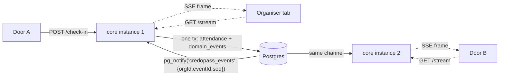

# LIVE-UPDATES — how a check-in reaches every other screen

> **In one line.** Today a check-in is visible in the tab that recorded it and, within five seconds,
> on another *kiosk*; every other screen is stale until it is remounted. This document says what to do
> about that — a small honest polling fix that ships now, and the SSE design from D4/D5 rewritten for
> the system as it actually exists (no device tokens, one API surface, `EventSource` cannot send an
> `Authorization` header).

| Doc | What it is |
|---|---|
| [`API-FIRST-REBUILD.md`](API-FIRST-REBUILD.md) | D4, D5 and §8.1 are the original design. Still the target; **superseded in the details listed in §6 below.** |
| [`API-THIRD-REBUILD.md`](API-THIRD-REBUILD.md) | D24 deleted device tokens. That is what forces the auth rethink in §5.3. |
| [`REBUILD-LOG.md`](REBUILD-LOG.md) | What actually shipped. |

**Status:** analysis + plan. Nothing in §5 is built. §4 is the part worth doing first.
**Written:** 2026-07-27, from a QA report against `epic/credopass-api-rewrite`.

---

## 1. The report, diagnosed

> *"I checked in from a separate window but it didn't reflect in the number immediately."*

That is three different behaviours depending on which window was watching, and only one of them is
the missing-SSE problem people assume.

| Watching window | Hook | Refresh today | What QA would see |
|---|---|---|---|
| **Kiosk** `/checkin/$eventId` | [`useCheckInState`](../packages/api-client/src/hooks/use-attendance.ts#L38) | poll **5 s**, continues in a background tab | Correct, up to 5 s late |
| **Event detail** `/events/$eventId` | `useEvent` → `counts.attended` | none | **Stale indefinitely** |
| **Attendees** `/attendees` | `usePeople` | none | **Stale indefinitely** |
| **Events list / summary tiles** | `useEvents`, `useEventsSummary` | none | **Stale indefinitely** |
| **Analytics** | `useAnalytics` | none | Fabricated numbers anyway (§ analytics is placeholder) |

Two facts explain the "indefinitely":

1. [`apps/web/src/lib/query-client.ts:19-20`](../apps/web/src/lib/query-client.ts#L19-L20) sets
   `staleTime: 30_000` **and `refetchOnWindowFocus: false`**. Nothing re-reads on tab focus, so
   switching back to a window that has been sitting open shows what it showed when it mounted.
2. [`useInvalidateAttendance`](../packages/api-client/src/hooks/use-attendance.ts#L56) invalidates
   the counter, the events scope and the people scope — **in the tab that performed the check-in**.
   A `QueryClient` is per document. There is no cross-tab channel.

So the honest summary is: **the kiosk counter is already shared and correct; every other surface has
no freshness policy at all.** The second one is a bug we can fix this week. The first one is a latency
budget question that SSE answers.

---

## 2. What "live" has to mean, per surface

Latency budgets, so we stop arguing about "immediately":

| Surface | Budget | Why that number |
|---|---|---|
| Kiosk counter, one door | **< 1 s** | The person is still standing there. It is the number they look at to know the scan worked. |
| Kiosk counter, second door | **< 2 s** | Two doors disagreeing by more than a moment is what makes staff distrust the tool. |
| Event detail, organiser watching arrivals | **< 5 s** | They are monitoring, not transacting. |
| Attendees list | **on focus + < 15 s** | A scanning surface; a row appearing a few seconds late costs nothing. |
| Events list, summary tiles, analytics | **on focus** | Nobody watches these live. |

Everything below the kiosk line is served perfectly well by polling. Only the top two lines justify a
streaming transport — which is the whole argument for doing §4 before §5.

---

## 3. Why the counter is right and the rest is wrong

`GET /events/{id}/checkin-state` exists and is authoritative — `liveCount` is a `count(*)` over
`attendance` filtered to `attended`, computed in
[`services/attendance.ts:107`](../services/core/src/services/attendance.ts#L107). The kiosk polls it.

Everything else reads counts that arrive **embedded in a bigger payload** (`EventSummary.counts`,
person rows) that nothing has been asked to keep fresh. That is the actual defect: we built one
freshness policy, for one screen, and left the rest on the React Query defaults — which were tuned
for "don't hammer the API", not for "this number changes while you watch it".

---

## 4. Tier 1 — the polling fix (do this first)

Half a day's work, no new infrastructure, and it closes the QA report for every surface except the
sub-second door case. It is also the fallback SSE degrades to, so it is not throwaway.

### 4.1 Turn window focus back on

```ts
// apps/web/src/lib/query-client.ts
refetchOnWindowFocus: true,
```

This is the single highest-value line in this document. It was set to `false` during the rewiring to
stop the old TanStack DB collections re-fetching whole tables on every alt-tab; those collections are
gone. With cursor pagination and 30 s `staleTime`, a focus refetch costs one request per mounted
query and fixes "I switched back to the other window and the number was old" outright.

### 4.2 Poll the surfaces that show a live number, only while the event is live

`deriveStatus` already tells the client whether an event is `ongoing`. Poll on that, not always:

| Hook | Change |
|---|---|
| `useEvent(id)` | `refetchInterval: event?.status === 'ongoing' ? 5_000 : false` |
| `usePeople({ eventId })` | `refetchInterval: 15_000` while the event is `ongoing` |
| `useEventsSummary` | leave alone — focus refetch is enough |

A completed event's detail page must not poll. Most events are not live; the steady-state request
volume barely moves.

### 4.3 Make a check-in in one tab invalidate the others

One `BroadcastChannel`, ~20 lines, no server involvement:

```ts
// packages/api-client/src/cross-tab.ts
const channel = new BroadcastChannel('credopass:invalidate');
export const broadcastInvalidate = (scope: string[]) => channel.postMessage(scope);
// consumer: queryClient.invalidateQueries({ queryKey: scope })
```

`useInvalidateAttendance` broadcasts what it already invalidates locally. Supported everywhere we
run except older Safari, where it silently does nothing and 4.2 covers it.

**This is not a substitute for SSE.** It syncs *this browser*, not the other door's tablet. It is
worth having anyway because the commonest QA setup — and the commonest organiser setup — is two
windows on one machine.

### 4.4 Landed when

Two windows on one machine, one on the kiosk and one on the event detail page: a check-in in the
first shows in the second within 5 s without touching anything, and instantly on focus.

---

## 5. Tier 2 — SSE, as it must actually be built

This is D4/D5, updated. The parts of the original design that survive unchanged: one append-only
`domain_events` table written in the same transaction as the state change; `LISTEN/NOTIFY` for
fan-out; no Redis; `Last-Event-ID` replay from the table; `text/event-stream` over one `GET`.

### 5.1 Shape



Every instance `LISTEN`s. The notify payload carries `{orgId, eventId, seq}` only; subscribers read
the row from `domain_events` by `seq`, so the 8 kB `NOTIFY` cap never binds and a subscriber can
never be told about a row that then rolls back (the notify fires post-commit).

### 5.2 `domain_events`

The table from §8.1 of the plan, with the columns the stream actually needs:

| Column | Type | Note |
|---|---|---|
| `seq` | `bigserial` PK | the SSE `id`; global monotonic ordering |
| `organization_id` | `uuid` NOT NULL | the authorization filter — a subscriber never sees another tenant's rows |
| `aggregate_type` / `aggregate_id` | `text` / `uuid` | `event`, `attendance`, `person`, … |
| `type` | `text` NOT NULL | `attendance.recorded`, `event.cancelled`, … (catalogue in §8.1 of the plan) |
| `payload` | `jsonb` NOT NULL | already-rendered fields the client shows; no second round trip |
| `actor_account_id` | `uuid` NULL | who did it |
| `created_at` | `timestamptz` NOT NULL | |

Indexes: `(organization_id, aggregate_id, seq)` for replay, `(seq)` implicit by PK.

**`seq` is a `bigserial`, so it is not gap-free under concurrent transactions** — a client replaying
"everything after 10482" can be handed a sequence that skips numbers, and must not treat a gap as
data loss. Worse, a slow transaction can commit `seq=10480` *after* `seq=10481` is already visible.
Two options, and Phase 4 must pick one deliberately rather than discovering it in production:

- **(a)** Replay by `created_at` with a 1 s safety overlap and de-duplicate client-side by `seq`.
- **(b)** Only publish `seq` values below `pg_snapshot_xmin(pg_current_snapshot())`, so nothing is
  streamed until every earlier transaction has committed. Correct, costs a second of latency.

Recommendation: **(a)** — the client is idempotent anyway because it re-reads state, and a second of
added latency defeats the point of the exercise.

### 5.3 Authenticating the stream — the part D5 did not have to solve

D5 assumed a door tablet held a **device token** it could put in a query string. D24 deleted device
tokens: a door is a person signed in with the `checkin` role. So the stream authenticates like every
other endpoint — `Authorization: Bearer <supabase jwt>` plus `X-Organization-Id` — and
**`EventSource` cannot send either header.** Three ways out:

| Option | Verdict |
|---|---|
| **Fetch + `ReadableStream`**, hand-parse the SSE framing | ✅ **Recommended.** Keeps the exact auth path every other request uses; the client already has `Last-Event-ID` state to manage, so writing the reconnect/backoff loop (~40 lines) buys control rather than costing it. |
| **Stream ticket**: `POST /events/{id}/stream-ticket` → single-use, 60 s, event-scoped token in the query string; native `EventSource` from there | Workable fallback. Costs a new endpoint, a new token type, and puts a credential in a URL that lands in access logs. |
| **Cookie session** | No. Auth is a Supabase JWT in `localStorage`; introducing a cookie session for one endpoint means CSRF surface for the whole API. |

Permission to subscribe is `attendance:read`, scoped to the event's organisation — which `checkin`,
`organizer`, `admin`, `owner` and `viewer` all hold. Same 404-not-403 rule as everywhere else: an
event in another tenant is not found.

### 5.4 The endpoint

```
GET /api/v1/core/events/{id}/stream
Accept: text/event-stream
Last-Event-ID: 10482          (on reconnect)
```

```
id: 10483
event: attendance.recorded
data: {"eventId":"…","personId":"…","firstName":"Ada","liveCount":37,"capacity":120}

: heartbeat                    ← every 20 s, so proxies do not idle the connection out
```

Note the path: `/api/v1/core/…`, not the `/api/v1/events/…` D5 wrote — the `/core` service prefix
landed after that document.

`streamSSE` from `hono/streaming` is the server side. **It is not an `OpenAPIHono` route in the
normal sense**: `defineRoute` describes JSON responses, and the OpenAPI document has no vocabulary
for a stream. Declare it with a `text/event-stream` response and a description that says the frames
are documented here; do not hand-write a fake JSON schema for it.

### 5.5 The hub

One module, `services/core/src/services/event-stream.ts` (`EventStreamService`, §4.12 of the plan):

- **One dedicated `pg` client**, checked out of the pool and held for the process lifetime, running
  `LISTEN credopass_events`. Drizzle's `$client` is a `Pool`; a pooled connection cannot be used for
  `LISTEN` because the next checkout gets a different socket. This is the single most likely
  implementation mistake.
- Reconnect the listener with backoff on connection loss, and on reconnect **re-read from the
  highest `seq` already delivered** — a dropped `LISTEN` connection loses notifications silently.
- An in-process `Map<eventId, Set<Subscriber>>`. Fan-out is O(subscribers on this instance).
- **A hard cap on concurrent streams per instance** (start at 200) answering 503 above it, and a
  connection-count metric. This is the Phase 4 risk called out in the plan; a cap makes it visible
  instead of fatal.
- Cloud Run caps a request at 60 minutes, so every long-lived kiosk reconnects at least hourly. The
  replay path is not an edge case — it runs every hour on every door, and must be tested as such.

### 5.6 The client

```ts
useEventStream(eventId, {
  onEvent: (frame) => { /* queryClient.setQueryData(checkinState, …) */ },
});
```

It writes into the **existing** query keys rather than introducing a parallel state tree — the
counter component keeps reading `useCheckInState` and does not know where the number came from. When
the stream is connected, the poll interval drops to `false`; when it drops, the poll resumes. That
is the rollback in the plan ("fall back to polling") implemented as a runtime state rather than a
deploy.

### 5.7 Landed when

Two browser tabs on the same event show the same count **within 1 s** of a check-in; killing the
connection and reconnecting replays the gap with no duplicates and no gaps (a `Last-Event-ID` test
that kills the socket mid-burst); a kiosk left open for two hours shows the correct count without a
reload; the connection-count metric is visible in logs.

---

## 6. Deltas from D4/D5 as written

| Plan said | Now |
|---|---|
| `GET /api/v1/events/{id}/stream` | `GET /api/v1/core/events/{id}/stream` — the service prefix landed later |
| Door tablets hold a device token | Device tokens are deleted (D24). Auth is a normal bearer token, which `EventSource` cannot carry — see §5.3 |
| `domain_events` also feeds analytics | Still true and still wanted, but analytics is fabricated today; the stream is the only consumer Phase 4 needs to satisfy |
| "Kiosk counter is `useState(0)`" | Fixed already — it is `GET /checkin-state`, polled. SSE is now a latency improvement, not a correctness fix |
| Nothing about non-kiosk surfaces | §1 shows they are the *worse* problem, and §4 fixes them without SSE |

New decisions, continuing D1–D26:

- **D27 — Polling first, streaming second.** The freshness bug is missing policy on ordinary screens,
  not missing transport. Tier 1 ships before Tier 2 and remains the documented fallback.
- **D28 — The stream is read with `fetch`, not `EventSource`.** Header auth is worth more than free
  reconnection; the reconnect loop is ours.
- **D29 — Stream frames write into existing query keys.** No component learns whether its data
  arrived by poll or by stream.
- **D30 — Replay tolerates `seq` gaps.** `bigserial` is not gap-free and commit order is not `seq`
  order; the client de-duplicates and the server overlaps by a second.

---

## 7. Rejected

- **Supabase Realtime.** It is already in the stack, which is exactly the trap: it publishes table
  changes straight to the browser using the anon key and RLS. RLS on the API path is currently inert
  (we connect as `postgres`), so this would be the one surface where tenancy is enforced by a
  mechanism nothing else uses — and it routes around the API contract that every other read goes
  through. Rejected on tenancy grounds, not on capability.
- **WebSockets.** Bidirectional; we are strictly server→client. Check-ins are `POST`s and stay that
  way.
- **Redis pub/sub.** D6 stands. `LISTEN/NOTIFY` works across instances and needs no new service.
- **Polling at 1 s.** Meets the latency budget and nothing else — 3,600 requests/hour/door for a
  number that changes a few dozen times all evening.

---

## 8. Work breakdown

| # | Work | Depends on | Size |
|---|---|---|---|
| T1.1 | `refetchOnWindowFocus: true` | — | minutes |
| T1.2 | Conditional polling on `useEvent` / `usePeople` while `ongoing` | — | ~1 h |
| T1.3 | `BroadcastChannel` cross-tab invalidation | — | ~2 h |
| T2.1 | `domain_events` table + migration | T1 | ~2 h |
| T2.2 | Write the row in the same transaction as every state change; post-commit `pg_notify` | T2.1 | ~1 day |
| T2.3 | `EventStreamService` — dedicated `LISTEN` connection, hub, caps, metrics | T2.2 | ~1 day |
| T2.4 | `GET /events/{id}/stream` with auth, replay, heartbeat | T2.3 | ~half day |
| T2.5 | `useEventStream` + poll/stream handoff | T2.4 | ~half day |
| T2.6 | Tests: replay across a killed socket, two-instance fan-out, tenancy (a subscriber never receives another org's frames) | T2.4 | ~1 day |

T2.6 is not optional. A stream that leaks another tenant's check-ins is a worse bug than a stale
number, and it is not covered by the existing adversarial suite — the matrix predates the endpoint.

## 9. Open questions

1. **Does the organiser's event-detail page get a stream, or just faster polling?** §2 says polling.
   Cheaper, and it keeps concurrent connections to roughly one per door.
2. **Retention on `domain_events`.** Append-only forever is fine at this scale and not fine at 100×.
   Decide the partition/archive story when analytics starts reading it, not before.
3. **Does the public event page get live counts?** It would need an unauthenticated stream and a rate
   limit. Out of scope until someone asks.
