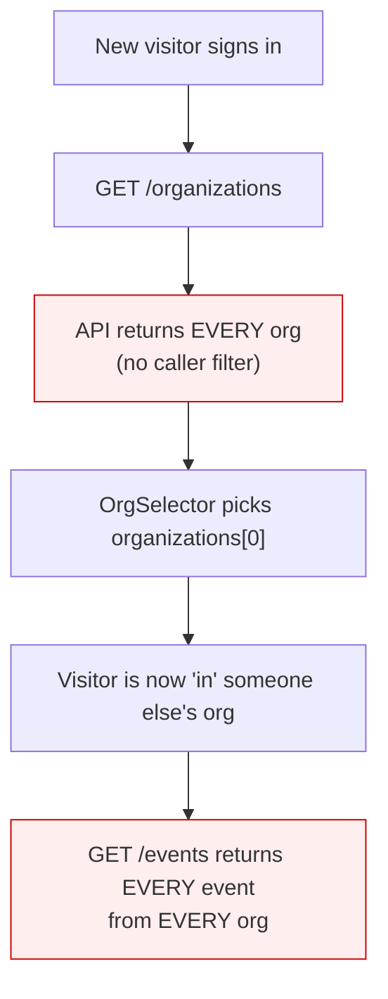
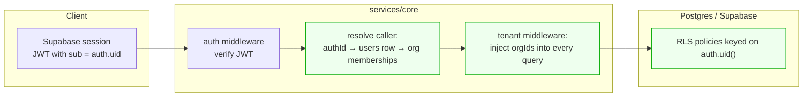

# Enabling real multi-user CredoPass

> **The refactor that turns one shared workspace into many private ones.** Today every visitor lands in the
> same organisation and sees the same data. This document explains exactly why, and the ordered work to fix
> it. Companion to [MVP-READINESS.md](MVP-READINESS.md), where this is the sole P0.

---

## 1. What happens today

Sign in as anybody, and you get the maintainer's workspace:



This is not a bug in one place. It is the absence of a layer.

## 2. Root causes

Four independent facts combine into the current behaviour. All four must be addressed; fixing any one alone
changes nothing.

| # | Cause | Evidence |
|---|---|---|
| **C1** | **App users are not linked to auth users.** `users.id` is `uuid().defaultRandom()` with no reference to Supabase `auth.users.id`. The database cannot tell which row *is* the caller. | [`tables/users.ts`](../packages/lib/src/schemas/tables/users.ts) |
| **C2** | **The API never reads the caller.** The auth middleware verifies the JWT and discards it. `jwtPayload` is used once, in one route, by email. | [`middleware/auth.ts`](../services/core/src/middleware/auth.ts), [`crud-factory.ts`](../services/core/src/util/crud-factory.ts) |
| **C3** | **Scoping is client-supplied, therefore not scoping.** `organizationId` is an entry in `allowedFilters` — a query param the client may pass, omit, or change to any value. `requireOrganizationId` defaults to `false` and no route sets it. | [`routes/events.ts`](../services/core/src/routes/events.ts) |
| **C4** | **RLS is on but wide open.** Every table has `.enableRLS()`, and the dev policies grant `anon` full access with `USING (true)`. The anon key is in the client bundle. | [`rls_dev_permissive.sql`](../services/core/drizzle/rls_dev_permissive.sql) |

**C1 is the keystone.** Until an app user can be resolved from `auth.uid()`, neither server-side scoping
(C2/C3) nor RLS (C4) can be expressed at all.

## 3. Target architecture

Two enforcement layers, deliberately redundant — the API scopes because it is convenient and fast, RLS
scopes because it cannot be bypassed:



The invariant to hold onto: **the tenant is derived from the token, never from the request body or query
string.** A client may say *which* of its orgs it wants; it may never say which org it belongs to.

---

## 4. The work, in order

### Phase 0 — Identity (unblocks everything)

Give `users` a link to Supabase auth.

```ts
// packages/lib/src/schemas/tables/users.ts
authId: uuid('authId').unique(),   // = auth.users.id; nullable during backfill
```

1. Add the column (nullable at first, so existing rows survive).
2. Backfill by email: for each Supabase auth user, set `authId` on the matching `users.email`.
3. On sign-in, ensure a `users` row exists for the session and its `authId` is set — a
   `POST /api/core/me/bootstrap` that is idempotent, or a Postgres trigger on `auth.users` insert.
4. Once backfilled and the bootstrap path is live, consider `notNull()`.

> **Why not just match on email?** That is what `org-memberships.ts:97` does today, and it is a stopgap:
> emails change, they are user-editable in some providers, and anonymous sessions have none. `auth.uid()`
> is stable and is the only thing RLS can reference.

**Anonymous/guest sessions** (`signInAsGuest`) need a decision here. They have an `auth.uid()` but no
email, and they exist to let a walk-in guest check in without an account. Recommendation: guests get **no**
`users` row and **no** org membership — they remain confined to the public surface, which is already
correctly isolated to a single event id. Do not let a guest session reach the authenticated collections.

### Phase 1 — Server-side scoping

1. In the auth middleware, after verification, resolve and stash the caller:
   `c.set('caller', { authId, userId, memberships: [{ organizationId, role }] })`.
2. Extend `CrudOptions` with a tenancy declaration, e.g.
   `tenancy: { column: 'organizationId' }`, and in the factory:
   - **GET list** — always `AND organizationId IN (caller.orgIds)`; if the client asked for a specific org
     it must be one of theirs, else 403.
   - **GET one / PUT / DELETE** — load the row, verify its `organizationId` is in `caller.orgIds`, else 404
     (prefer 404 over 403: it does not leak existence).
   - **POST** — ignore any `organizationId` in the body that the caller is not a member of.
3. Make it fail closed: a table with no `tenancy` declaration should require an explicit
   `tenancy: 'global'` opt-out, so forgetting to declare scope is a startup error rather than a silent leak.
4. `organizations` itself scopes through `orgMemberships` rather than a column.
5. Roles (`owner`/`admin`/`member`/`viewer`) become enforceable here — `viewer` should not reach a write.

### Phase 2 — Real RLS

Replace the permissive policies with membership-scoped ones. Sketch:

```sql
CREATE POLICY events_tenant ON public.events
  FOR ALL TO authenticated
  USING (
    "organizationId" IN (
      SELECT m."organizationId" FROM public.org_memberships m
      JOIN public.users u ON u.id = m."userId"
      WHERE u."authId" = auth.uid()
    )
  );
```

- Revoke everything from `anon`. The public event surface goes through the API's service role, not the
  anon key — that endpoint is already narrow and token-optional by design.
- Index `users(authId)` and keep `org_memberships(userId)` indexed; these run on every row check.
- Consider a `SECURITY DEFINER` helper (`current_org_ids()`) to keep policies readable and cheap.

### Phase 3 — Onboarding

With scoping live, a new user correctly sees *nothing* — so they need somewhere to land.

1. First-run: if the caller has no memberships, route to "Create your organisation" instead of an empty
   events list.
2. Creating an org creates the `owner` membership in the same transaction.
3. **Delete the `organizations[0]` fallback** in `OrgSelector` — it is the line that produces the shared
   identity, and it must not survive this work.
4. Invitations: `orgMemberships` already has `invitedBy`/`invitedAt`/`acceptedAt`. Wire them up so a second
   person can join a real org.

### Phase 4 — Hardening

- Rotate every credential currently committed in `.env` files; they must be assumed public.
- Commit migrations (stop gitignoring `**/drizzle/`) so tenancy changes are reviewable and reproducible.
- Add a local Postgres so migrations are not tested against production.

---

## 5. Test plan

The failure mode here is silent leakage, which passes every happy-path test. Test adversarially:

| Test | Expectation |
|---|---|
| User A lists events while B's events exist | Only A's returned |
| A requests `?organizationId=<B's org>` | 403, not B's data |
| A `GET`s B's event by id | 404 |
| A `PUT`s B's event | 404, row unchanged |
| A creates an event with B's `organizationId` in the body | Created in A's org, or rejected — never B's |
| Brand-new user with no memberships | Empty everything + onboarding, never someone else's org |
| Anonymous guest hits `/events` | 401/403 |
| Anonymous guest hits `/public/events/:id` | Works, and only for that id |
| `viewer` role attempts a write | Rejected |

Write these against the API *before* Phase 1, so they start red and go green. Add a direct-PostgREST test
with the anon key asserting it now returns nothing — that is the check that Phase 2 actually landed.

## 6. Risks

- **Phase 2 will look like data loss.** Once RLS bites, rows without a resolvable membership vanish from
  the UI. Complete the Phase 0 backfill first and verify counts.
- **Ordering is not optional.** Phase 2 before Phase 0 locks everyone out, including you.
- **Collections cache across identity changes.** `@credopass/api-client` collections are client-side and
  keyed by query, not by user — sign-out must reset them, or the next user briefly sees the previous one's
  data from cache.
- **RLS costs per row.** Without indexes on `users(authId)` and `org_memberships(userId)`, list endpoints
  degrade quickly.
- **Feature work written now compounds the problem.** Any new screen built against the unscoped model needs
  revisiting; that is the argument for doing this before the next feature, not after.