# `@credopass/api-client`

> The data layer both the web and mobile apps talk to. Offline-first TanStack DB collections + a thin authed fetch client.

Apps never call `fetch` against the API directly. They read and write **collections** — local, reactive, offline-first stores that sync to the Hono API in the background.

**Depends on:** `@credopass/lib` (for schemas + types), `@tanstack/db`, `@tanstack/query-*`.
**Consumed by:** `apps/web`, `apps/mobile`.

---

## The shape of it

```mermaid
flowchart TD
    App["Component<br/>(web / mobile)"] -->|read/insert/update/delete| Col["TanStack DB Collection"]
    Col -->|optimistic| App
    Col -->|queryFn / onInsert…| Client["client.ts<br/>authHeaders() + fetch"]
    Client -->|Bearer JWT| API["Hono API /api/v1/core"]
    API -->|rows| Col
    Cfg["configureAPIClient()"] -.->|baseURL + getAuthToken| Client
```



- **`client.ts`** — `configureAPIClient({ baseURL, getAuthToken })` is called once at app startup. `authHeaders()` attaches the Supabase `Bearer` token to every request. Also exports `fetchAnalytics()`.
- **`collections/`** — one file per entity (`users`, `organizations`, `org-memberships`, `events`, `event-members`, `attendance`, `loyalty`). Each defines the `queryFn` (list) plus `onInsert` / `onUpdate` / `onDelete` handlers that POST/PUT/DELETE to the API.
- **`collections/index.ts`** — `getCollections()` returns a lazily-built singleton of every collection sharing one `QueryClient`.
- **`collections/persisted-ids.ts`** — reconciles optimistic client-generated UUIDs with the server-assigned ids after a write (see `resolvePersistedUserId`).

## Usage

```ts
// 1. Configure once (app entry point)
import { configureAPIClient } from '@credopass/api-client';
configureAPIClient({
  baseURL: import.meta.env.VITE_API_URL ?? '/api/v1/core',
  getAuthToken: getAccessToken, // from @credopass/lib/supabase
});

// 2. Use collections anywhere
import { getCollections } from '@credopass/api-client/collections';
const { events, attendance } = getCollections();

events.insert({ id: crypto.randomUUID(), name: 'Jazz Night', /* … */ });
const going = attendance.toArray.filter((a) => a.eventId === id && a.attended);
```

## Why collections instead of raw fetch

- **Offline-first** — writes apply locally and optimistically, then sync. A kiosk keeps working with no signal.
- **Reactive** — components re-render when the underlying data changes, across tabs/devices.
- **One contract** — every collection validates against the same `@credopass/lib` Zod schema the server uses.

> The **public event page** (walk-in check-in with no login) is the one exception — it hits the token-optional `/api/v1/core/public/*` endpoints. See `services/core` and `apps/web`.
