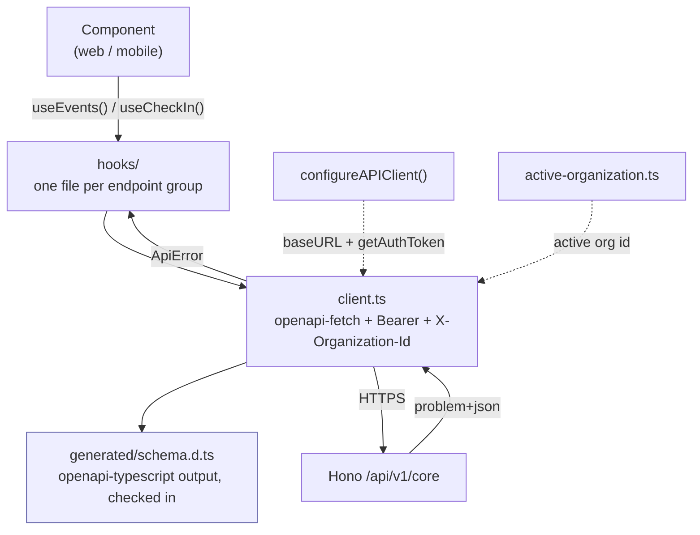

# `@credopass/api-client`

> The only way apps reach the API. Typed TanStack **Query** hooks over a generated OpenAPI contract.

Apps never call `fetch` for app data. They import a hook — `useEvents`, `useCheckIn`, `usePass` — and
the generated types check the call at compile time.

**Depends on:** `@tanstack/react-query`, `openapi-fetch`. Not `@credopass/lib` — the contract comes
from the service's own OpenAPI document, not from the Drizzle tables.
**Consumed by:** `apps/web`, `apps/mobile`.

> **TanStack DB collections are gone and are not coming back.** This package used to hold
> offline-first, optimistic, client-authoritative collections per entity. The server decides now and
> the client renders (API-SECOND-REBUILD §1.2). If you are looking for `getCollections()`, it does
> not exist.

---

## Three layers



| Layer | File | Reach for it |
|---|---|---|
| **Hooks** | `src/hooks/*.ts` | Always. One file per endpoint group. |
| **Client** | `src/client.ts` | Only for something no hook covers yet. |
| **Generated** | `src/generated/schema.d.ts` | Never by hand — `nx run api-client:generate` writes it. |

`src/types.ts` **derives** every contract type from `generated/schema.d.ts`. It never restates one.

## The hooks

| File | Covers |
|---|---|
| `use-me.ts` | `/me`, `/me/context` — the account, its memberships, and the effective `permissions[]` for the active organization. The first call every screen makes. |
| `use-organizations.ts` | Organizations, members, invitations. `GET /organizations` returns **the caller's own** and is not a directory. |
| `use-events.ts` | Events and the event composer. |
| `use-people.ts` | The per-tenant person record and its attendance stats. |
| `use-attendance.ts` | Check-in and the durable attendance row. |
| `use-public.ts` | The token-optional attendee surface — public event page, register, walk-up check-in, the pass. |
| `use-analytics.ts` | The analytics contract. **The numbers behind it are fabricated placeholders** (`services/core/src/services/analytics/`) — they do not read the database yet. |
| `use-billing.ts` | `GET /plans` and `PUT /organizations/{id}/plan`. **No payment is taken** — the endpoint writes a column (D15). |

## Setup

```ts
// Once, at app entry (apps/web/src/main.tsx)
import { configureAPIClient } from '@credopass/api-client';

configureAPIClient({
  baseURL: import.meta.env.VITE_API_URL ?? '/api/v1/core',
  getAuthToken,   // from @credopass/lib/supabase
});
```

Then anywhere:

```tsx
import { useEvents, useCheckIn } from '@credopass/api-client';

const { data: events = [], isLoading } = useEvents({ group: 'upcoming' });
const checkIn = useCheckIn(eventId);
```

## The active organization

`src/active-organization.ts` owns which organization the console is scoped to. Two things follow
from that, and both are load-bearing:

- The active id is sent as `X-Organization-Id` on every org-scoped request. **The client may say
  which of its organizations it wants; it may never say which it belongs to** — the server checks
  membership regardless.
- The active id is part of every org-scoped **query key**. Switching organizations therefore re-keys
  the cache rather than reloading the page, and the previous tenant's rows cannot survive the switch.

It is resolved at bootstrap from `/me/context` and remembered per account — never "whatever is first
in a global list", which is the bug this replaced.

## Errors

The API speaks RFC 9457 problem+json. `client.ts` turns a non-2xx response into an `ApiError`
carrying the machine-readable `code`:

```ts
import { hasProblemCode, ProblemCode } from '@credopass/api-client';

try {
  await removeMember.mutateAsync(accountId);
} catch (error) {
  if (hasProblemCode(error, ProblemCode.LAST_OWNER)) {
    toast.error('An organization needs at least one owner.');
  }
}
```

Branch on `code`, never on the message text — messages are copy and will change.

## Regenerating after an API change

The generated schema is checked in, so this is a deliberate two-step:

```bash
nx run coreservice:openapi:export     # service → services/core/openapi.json
nx run api-client:generate            # openapi.json → src/generated/schema.d.ts
nx run api-client:typecheck
```

Commit the regenerated file with the API change. A client whose contract lags the server is how you
get a runtime shape mismatch that no test catches.

> **Never `.nullable()` a registered Zod schema in the API.** `Ref.nullable()` renders as `allOf`
> with a nullable object type, which openapi-typescript turns into an uninhabited intersection *and
> silently drops the nullability*. Use `z.union([Ref, z.null()])`. This is a client-side bug with a
> server-side cause, which is why it is written down here too.
