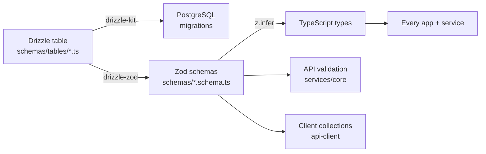
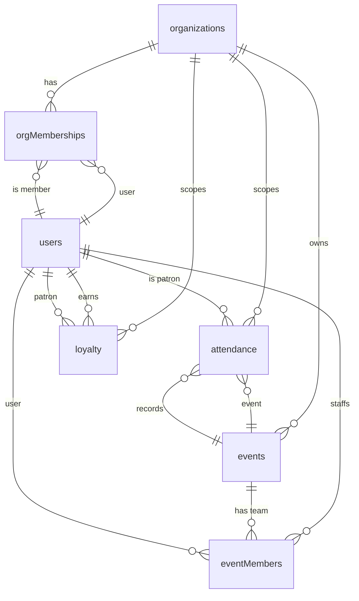

# `@credopass/lib`

> The shared brain. Schemas, types, enums, stores, auth, and utilities that **every** app and service imports.

If a piece of knowledge needs to be identical on the web app, the mobile app, the API server, and the marketing site, it lives here. This package has no build step — it's consumed directly as TypeScript source across the monorepo.

**Depends on:** nothing internal (this is the root of the dependency graph).
**Consumed by:** `@credopass/api-client`, `@credopass/ui`, `apps/web`, `apps/mobile`, `apps/website`, `services/core`.

---

## Why this package exists

The single most important idea in CredoPass: **the database schema is defined once and everything else is derived from it.** No hand-written types that drift from the DB, no duplicate validation.



Add a column to a table once → the migration, the Zod validator, and the TS type all follow.

---

## Layout

| Path | What's inside |
|------|---------------|
| `src/schemas/tables/` | **Drizzle table definitions** — the source of truth. 7 tables (see below). |
| `src/schemas/tables/index.ts` | Drizzle `relations()` + the composed `schema` object handed to the DB client. |
| `src/schemas/*.schema.ts` | Zod schemas auto-generated from tables via `drizzle-zod`, with refinements (Create/Update/Insert/Select variants). |
| `src/schemas/enums.ts` | Shared Zod enums (event status, roles, plans, check-in method, loyalty tier). |
| `src/stores/` | Zustand stores (`appStore`, `toolbarStore`) shared by the web UI. |
| `src/theme/` | `ThemeProvider` + `useTheme` (light/dark), used by web and website. |
| `src/supabase/` | Shared Supabase client + auth helpers. |
| `src/analytics/` | The analytics **response contract** (`AnalyticsResponse`, `AnalyticsRange`) — shared by the API generator and the client fetcher. |
| `src/hooks/`, `src/utils/`, `src/layout/`, `src/constants/` | Cross-app hooks, date/formatting/event helpers, grid-layout wrapper, constants. |

## The data model (7 tables)



| Table | Role | Key columns |
|-------|------|-------------|
| `organizations` | **Tenant boundary.** Everything hangs off an org. | `plan`, `slug`, `externalAuth*`, `stripe*` |
| `orgMemberships` | Who belongs to an org and how. | `role` (owner/admin/member/viewer), `invitedBy` |
| `users` | People — patrons and staff alike. | `email`, `firstName`, `lastName`, `phone` |
| `events` | A gathering to track. | `status`, `checkInMethods[]`, `requireCheckOut`, `capacity` |
| `eventMembers` | Event-level team (replaces a single `hostId`). | `role` (organizer/co-host/staff/volunteer) |
| `attendance` | **The point of the product.** One durable row per (event, patron). | `attended`, `checkInTime`, `checkOutTime`, `checkInMethod` |
| `loyalty` | Points, tiers and rewards per org. | `tier`, `points`, `reward`, `expiresAt` |

> **Attendance is data, not a flag.** `events.checkInMethods` only configures *which* check-in mechanisms a door offers (`qr` / `manual` / `external_auth`). The `attendance` row — with a unique constraint on `(eventId, patronId)` — is the real record of who showed up.

## Enums (`schemas/enums.ts`)

`EventStatus` · `LoyaltyTier` · `OrgPlan` · `OrgRole` · `EventRole` · `CheckInMethod` · `LiveUpdateType`

## Using it

```ts
// Tables + relations (server / migrations)
import { schema, events, attendance } from '@credopass/lib/schemas';

// Zod validators + inferred types (anywhere)
import { CreateEventSchema, type EventType } from '@credopass/lib/schemas';

// Cross-app helpers
import { useTheme } from '@credopass/lib/theme';
import { getAccessToken } from '@credopass/lib/supabase';
```

## When you change a table

1. Edit `src/schemas/tables/<table>.ts`.
2. The Zod schema in `src/schemas/<table>.schema.ts` follows automatically (drizzle-zod). Add refinements there if needed.
3. Generate + apply the migration: `nx run coreservice:migrate`.
4. Types and validation are now live everywhere — no other edits needed.
