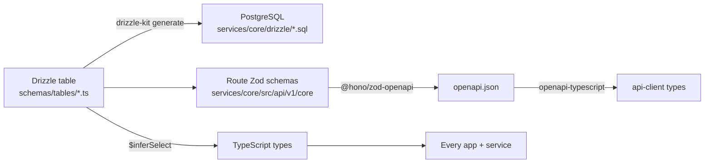
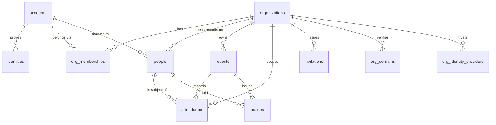

# `@credopass/lib`

> The shared brain. Schemas, types, enums, stores, auth, and utilities that **every** app and service imports.

If a piece of knowledge needs to be identical on the web app, the mobile app, the API server, and the marketing site, it lives here. This package has no build step — it's consumed directly as TypeScript source across the monorepo.

**Depends on:** nothing internal (this is the root of the dependency graph).
**Consumed by:** `@credopass/api-client`, `@credopass/ui`, `apps/web`, `apps/mobile`, `apps/website`, `services/core`.

---

## Why this package exists

The single most important idea in CredoPass: **the database schema is defined once and everything else is derived from it.** No hand-written types that drift from the DB, no duplicate validation.



Add a column to a table once → the migration, the API's request validation, the OpenAPI document and
the client's types all follow. **Never hand-write a type or validator that duplicates a table.**

---

## Layout

| Path | What's inside |
|------|---------------|
| `src/schemas/tables/` | **Drizzle table definitions** — the source of truth. 11 tables (see below). |
| `src/schemas/tables/index.ts` | Drizzle `relations()` + the composed `schema` object handed to the DB client. |
| `src/schemas/enums.ts` | Shared Zod enums (event status, org plan, org role, check-in method, attendance state). |
| `src/schemas/email.schemas.ts` | The sign-in / sign-up / reset-password form validators. |
| `src/stores/` | Zustand stores (`appStore`, `toolbarStore`) shared by the web UI. |
| `src/theme/` | `ThemeProvider` + `useTheme` (light/dark), used by web and website. |
| `src/supabase/` | Shared Supabase client + auth helpers. |
| `src/hooks/`, `src/utils/`, `src/constants/` | Cross-app hooks, date and event helpers, constants. |

> **There are no per-table `*.schema.ts` validators any more.** Request validation lives in the Zod
> schemas beside each route in `services/core`, which are also what generate the OpenAPI document —
> one definition, not two.

## The data model (11 tables)

The rewrite split the old `users` table three ways. That split is the whole tenancy model, so it is
worth holding in your head:

- **`accounts`** — the login. One per human, global.
- **`identities`** — the credential that proves an account, keyed on `(issuer, subject)`. Supabase is
  the only configured issuer until a tenant brings their own IdP, at which point that is a row in
  `org_identity_providers` rather than a code change.
- **`people`** — the record an *organisation* keeps about someone. The same human in two
  organisations is two `people` rows and one `accounts` row. `people.accountId` is nullable: an
  attendee who never signed in is still a person.



| Table | Role | Key columns |
|-------|------|-------------|
| `accounts` | The login. Global, one per human. | `email`, `display_name` |
| `identities` | The credential proving an account. | `issuer`, `subject`, `account_id` |
| `organizations` | **The tenant boundary.** Everything hangs off an org. | `slug`, `plan` |
| `org_memberships` | Who belongs to an org and as what. | `role` (owner/admin/organizer/checkin/viewer) |
| `people` | The **per-tenant** record of a human. | `organization_id`, `account_id` (nullable), `email` |
| `events` | A gathering to track. | `status`, `check_in_methods[]`, `capacity` |
| `attendance` | **The point of the product.** One durable row per (event, person). | `state`, `checked_in_at`, `check_in_method` |
| `passes` | The attendee's pass; the token in the URL is the credential. | `token`, `event_id`, `person_id` |
| `invitations` | Pending membership. Token shown once, on creation. | `email`, `role`, `expires_at` |
| `org_domains` | Verified email domains for an org. | `domain`, `verified_at` |
| `org_identity_providers` | A tenant's own IdP (SSO). Schema exists, endpoints do not yet. | `issuer`, `organization_id` |

> **Attendance is data, not a flag.** `events.checkInMethods` only configures *which* check-in
> mechanisms a door offers (`qr` / `manual` / `self` / `pass`). The `attendance` row — unique on
> `(event_id, person_id)` — is the real record. `state` distinguishes `registered` from `attended`
> from `no_show`, which is the distinction ticketing tools cannot make.

**Every identifier is unquoted `snake_case`.** The old quoted `"camelCase"` columns made every RLS
policy a quoting exercise, which is why the schema was rewritten this way.

## Enums (`schemas/enums.ts`)

`EventStatusEnum` · `OrgPlanEnum` · `OrgRoleEnum` · `CheckInMethodEnum` · `AttendanceStateEnum`

There is no loyalty tier enum. Loyalty was deleted outright in the rebuild.

## Using it

```ts
// Tables + relations (server / migrations)
import { schema, events, attendance } from '@credopass/lib/schemas';

// Shared enums and the auth-form validators
import { OrgRoleEnum, resetPasswordSchema } from '@credopass/lib/schemas';
// NOTE: there are no per-table Zod validators here any more. Request validation
// lives in the Zod schemas beside each route in services/core, which are also
// what generate the OpenAPI document — one definition, not two.

// Cross-app helpers
import { useTheme } from '@credopass/lib/theme';
import { getAccessToken } from '@credopass/lib/supabase';
```

## When you change a table

1. Edit `src/schemas/tables/<table>.ts` — and register it in `tables/index.ts` if it is new.
2. Generate the migration and **read the SQL** before applying it:
   `cd services/core && bunx drizzle-kit generate`
3. Apply it locally: `nx run coreservice:migrate`
4. Regenerate the client contract: `nx run coreservice:openapi:export && nx run api-client:generate`
5. Commit the table, the migration and the regenerated client together.

The full procedure — including the remote Supabase cutover — is in
[`docs/DATABASE-MIGRATION.md`](../../docs/DATABASE-MIGRATION.md).

> **Adding a column is not additive at runtime.** Drizzle builds an explicit column list from the
> schema, so a new column makes *every* query ask for it. Every database the code runs against must
> be migrated before the code ships.
