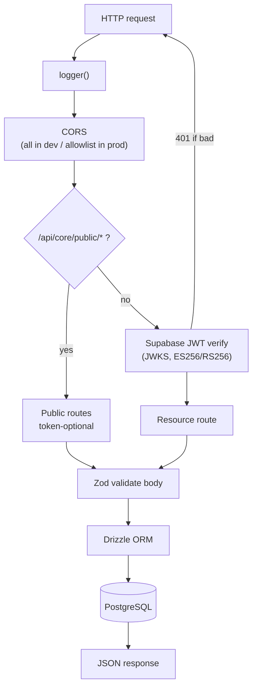

# `coreservice` — CredoPass Core API

> The only backend. A lightweight [Hono](https://hono.dev) server on [Bun](https://bun.sh) that talks to PostgreSQL through Drizzle, verifies Supabase JWTs, and validates everything with the shared Zod schemas.

**Package name:** `@credopass/services` · **Nx project:** `coreservice`
**Depends on:** `@credopass/lib` (schemas), `hono`, `drizzle-orm`, `pg`, `zod`.
**Base path:** `/api/core` · **Dev port:** `8080`.

---

## Request lifecycle



## What's inside

| Path | Purpose |
|------|---------|
| `src/index.ts` | Server bootstrap: middleware order, route mounting, Swagger UI (`/api/core/docs`), health check, error handler. |
| `src/middleware/auth.ts` | **Supabase JWT verification.** Verifies against the project JWKS — no shared secret. Built lazily so the service always boots (health stays green even if `SUPABASE_URL` is missing). `AUTH_DISABLED=true` bypasses it (local dev only). |
| `src/util/crud-factory.ts` | `createCrudRoute()` — generates GET/GET:id/POST/PUT/DELETE for a table with filtering, sorting, uniqueness checks, and multi-tenant `organizationId` gating. Most resource routes are one call to this. |
| `src/routes/` | Resource routers: `users`, `organizations`, `org-memberships`, `events`, `event-members`, `attendance`, `loyalty`, `analytics`, and `public`. |
| `src/routes/public.ts` | **Token-optional surface** for the attendee event page. Exactly two operations, both scoped to one event id. |
| `src/analytics/` | Deterministic **fabricated** analytics generator (pure, no DB). Same input → same numbers. Swappable for real aggregates later; the response shape is the contract in `@credopass/lib/analytics`. |
| `src/db/` | DB client factory (`getDatabase`), exports, and the seed script. |
| `drizzle/` | Generated SQL migrations + `rls_dev_permissive.sql`. |

## Auth model

Every route under `/api/core/*` requires a **Supabase-signed JWT** (`Authorization: Bearer …`), verified against the project's JWKS endpoint. Two deliberate holes:

- **Public routes** (`/api/core/public/*`) are mounted *before* the auth middleware so a shared event link/QR works with no account. They can only read one event or create the caller's own attendance row.
- **`/health`, `/docs`, `/openapi.json`** are always open.

## The public event surface (`routes/public.ts`)

```
GET  /api/core/public/events/:id          → read-only public fields for one event
POST /api/core/public/events/:id/attend   → register (attended=false) or check in (attended=true)
```

`mode: 'register'` writes an RSVP; `mode: 'checkin'` flips it to attended without losing the original registration. Rejects check-ins for completed/cancelled events. This is what powers the "walk-in guest" journey.

## Commands

```bash
nx run coreservice:start      # dev server on :8080 (bun --watch)
nx run coreservice:migrate    # drizzle-kit generate && migrate
nx run coreservice:seed       # seed the database
nx run coreservice:studio     # Drizzle Studio (DB browser)
nx run coreservice:build      # bundle with Bun
nx run coreservice:docker:build
nx run coreservice:deploy     # gcloud run deploy → Cloud Run
nx run coreservice:test       # bun test
```

## Environment

| Var | Purpose |
|-----|---------|
| `DATABASE_URL` | PostgreSQL connection string. |
| `SUPABASE_URL` | Project URL — used to fetch the JWKS for token verification. |
| `AUTH_DISABLED` | `true` disables JWT checks. **Local dev only.** |
| `PORT` | Listen port (defaults to `3000`; the Nx `start` target sets `8080`). |
| `THROTTLE_DELAY` | Artificial latency (ms) for testing, dev only. |

## Adding a resource

1. Define the table + Zod schemas in `@credopass/lib`.
2. Create `src/routes/<thing>.ts` — usually just `createCrudRoute({ table, createSchema, updateSchema, … })`.
3. Mount it in `src/index.ts` under `/api/core/<thing>` (after the auth middleware).
4. Add a matching collection in `@credopass/api-client` if the apps need it.
