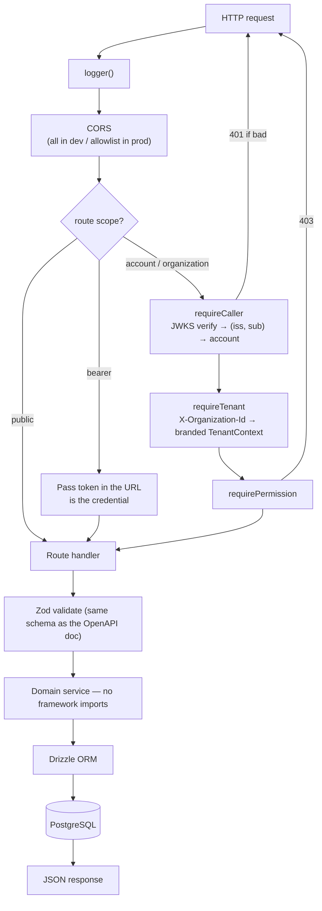

# `coreservice` — CredoPass Core API

> The only backend. A [Hono](https://hono.dev) server on [Bun](https://bun.sh) that talks to PostgreSQL through Drizzle, verifies JWTs against an issuer registry, and generates its own OpenAPI document from the Zod schemas that validate requests.

**Package name:** `@credopass/services` · **Nx project:** `coreservice`
**Depends on:** `@credopass/lib` (schemas), `@hono/zod-openapi`, `drizzle-orm`, `pg`, `zod`.
**Base path:** `/api/v1/core` · **Dev port:** `8080`.

> `/api/core` — the old CRUD-factory surface — **is gone.** `src/routes/`,
> `src/util/crud-factory.ts` and `src/analytics/` were deleted, and the service 404s that path.
> If you find `/api/core` in a config file, that config is a bug (it was still in
> `apps/web/.env.production` until API-THIRD-REBUILD).

---

## Request lifecycle



## The seven rules

Enforced by code, not convention. Breaking one fails the build, the lint, or the boot.

1. **Every route is created with `defineRoute`**, declaring `scope` and — for
   `scope: 'organization'` — a `permission`. A bad declaration crashes the service on startup.
2. **Errors are `ProblemError`** from `src/http/problem.ts`. Never `c.json({ error })`, never
   `HTTPException`.
3. **Never hand-write OpenAPI.** `/api/v1/core/openapi.json` is generated from the same Zod
   schemas that validate requests.
4. **Handlers never build a `TenantContext`.** Only `requireTenant` does. The type is branded, so
   a handler cannot fabricate one without an explicit cast.
5. **Domain services import no framework.** Nothing under `src/services/` may import `hono`.
   Lint blocks it.
6. **A resource in another tenant returns 404, not 403.** 403 means "your tenant, wrong role".
   Never leak that a row exists.
7. **Every tenant-scoped query filters on `ctx.organizationId` explicitly.** Routes never query;
   services do.

## What's inside

| Path | Purpose |
|------|---------|
| `src/index.ts` | Bootstrap: CORS, mounting, error handler. Mounts only `/api/v1/core`. |
| `src/api/v1/core/` | The routes — one file per resource, each a `defineRoute` + handler pair. |
| `src/http/define-route.ts`, `http/route-registry.ts` | Route declaration, and the boot-time assertion that every route declares a valid scope/permission pair. |
| `src/http/problem.ts` | The error format (RFC 9457) and every `ProblemCode`. |
| `src/middleware/caller.ts` | `requireCaller` (token → account, plus first-sign-in organisation provisioning), `requireTenant` (header → branded `TenantContext`), `requirePermission`. |
| `src/identity/issuer-registry.ts` | Which issuers are trusted, and JWKS verification. |
| `src/authz/permissions.ts` | The 25 permissions and the role matrix — the only place that decides what a role may do. |
| `src/authz/plans.ts` | Per-plan entitlements (how many organisations an account may own). |
| `src/tenancy/context.ts` | The branded `TenantContext` and `can()`. |
| `src/services/` | Domain logic. No framework imports. |
| `src/db/` | `client.ts` (pool + Drizzle), `schema-check.ts`, `seed.ts`. |
| `sql/` | Out-of-band SQL: revoking public PostgREST access, and the probe that verifies it. |
| `drizzle/` | Migrations, **tracked in git and reviewed like code.** |

## Auth model

Four route scopes, declared per route:

| Scope | Credential | Example |
|-------|-----------|---------|
| `organization` | JWT + `X-Organization-Id` + a permission | `GET /events` |
| `account` | JWT, self-scoped, no permission | `GET /me/context` |
| `public` | none | `GET /public/events/{id}` |
| `bearer` | the pass token **in the URL** | `GET /p/{token}` |

`/health`, `/docs` and `/openapi.json` are always open.

**There is no guest tier and no device tier.** A door tablet is a person signed in with the
`checkin` role, which can read the event and record arrivals and nothing else. See
[`docs/API-THIRD-REBUILD.md`](../../docs/API-THIRD-REBUILD.md), D20 and D24 — and do not
reintroduce a second authentication system for doors without reading why the first one went.

Signing in commissions an organisation (`ensureDefaultOrganization`, called from `requireCaller`
on the first request of a brand-new account). That is the whole of onboarding.

## The public attendee surface

```
GET  /public/events/{id}             → the shared event link, no auth
POST /public/events/{id}/register    → register; returns a durable pass URL synchronously
POST /public/events/{id}/check-in    → walk-up self check-in (honours allow_self_check_in)
POST /public/events/{id}/resend-pass → always 202, registered or not
GET  /p/{token}                      → the pass; the token in the URL is the credential
POST /p/{token}/check-in             → check yourself in from the pass
```

`resend-pass` answers identically whether or not the address is registered, on purpose: a
different answer is an oracle for "is this person attending this event".

## Commands

```bash
nx run coreservice:start              # dev server on :8080 (bun --watch)
nx run coreservice:verify             # lint + typecheck + test — run before saying "done"
nx run coreservice:test               # unit + structural, no DB, must always pass
nx run coreservice:test:integration   # services against real Postgres; starts its own DB
nx run coreservice:test:adversarial   # the tenancy suite
nx run coreservice:db status          # does the DB match the code? START HERE when confused
nx run coreservice:db reset           # drop + replay migrations (localhost only, by design)
nx run coreservice:migrate            # apply pending migrations to whatever DATABASE_URL points at
nx run coreservice:docs               # Scalar at /api/v1/core/docs
nx run coreservice:token              # mint a JWT for the Scalar auth box
nx run coreservice:openapi:export     # write openapi.json for desktop clients
nx run coreservice:build              # bundle with Bun
nx run coreservice:deploy             # gcloud run deploy → Cloud Run
```

To generate a migration **without applying it** (no database contact):

```bash
cd services/core && bunx drizzle-kit generate --name=<what_it_does>
```

**Read [`docs/DATABASE-MIGRATION.md`](../../docs/DATABASE-MIGRATION.md) before pointing
`DATABASE_URL` at anything remote.** The remote Supabase instance still runs the pre-rewrite schema,
and there is no automatic path from `users` to `accounts` + `identities` + `people`.

### RLS is currently inert on the API path

`drizzle/0001_rls.sql` creates the `credopass_api` role (`NOSUPERUSER NOBYPASSRLS`) and a
membership-scoped policy on every tenant table. **The API does not use that role.** It connects as
`postgres`, which is `BYPASSRLS`, so those policies are not evaluated — tenancy is enforced by
exactly one layer today: the explicit `ctx.organizationId` predicate every service applies by hand,
which is what the adversarial suite polices.

Switching is not a one-line change: the policies read the caller from
`current_setting('app.account_id')`, and nothing in `src/` sets it. Point the API at `credopass_api`
today and every query returns zero rows. The ordered fix is in `docs/DATABASE-MIGRATION.md` §6.

## Environment

| Var | Purpose |
|-----|---------|
| `DATABASE_URL` | PostgreSQL connection string. |
| `TEST_DATABASE_URL` | Throwaway Postgres for the test suites. **Never the real one** — they truncate. |
| `SUPABASE_URL` | Project URL — used to fetch the JWKS for token verification. |
| `PORT` | Listen port (the Nx `start` target sets `8080`). |
| `THROTTLE_DELAY` | Artificial latency (ms) for testing, dev only. |

## Adding an endpoint

1. Change the table in `@credopass/lib/schemas/tables` if the model moves, then
   `bunx drizzle-kit generate`.
2. Put the domain logic in `src/services/<thing>.ts` — no framework imports, and filter on
   `ctx.organizationId`.
3. Add the route in `src/api/v1/core/<thing>.ts` with `defineRoute`, declaring `scope` and
   `permission`.
4. `nx run coreservice:openapi:export && nx run api-client:generate` so the client picks it up.
5. Add an adversarial test if it touches tenancy.
